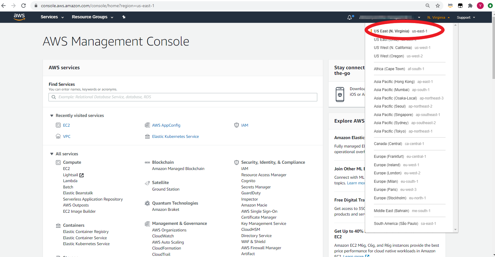
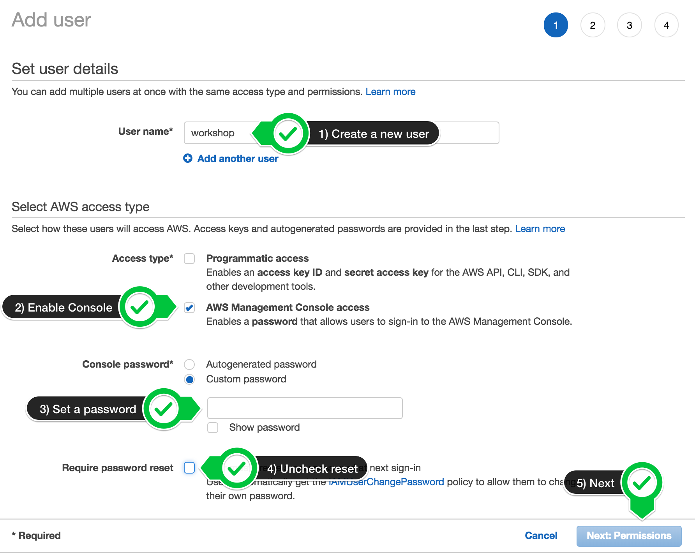
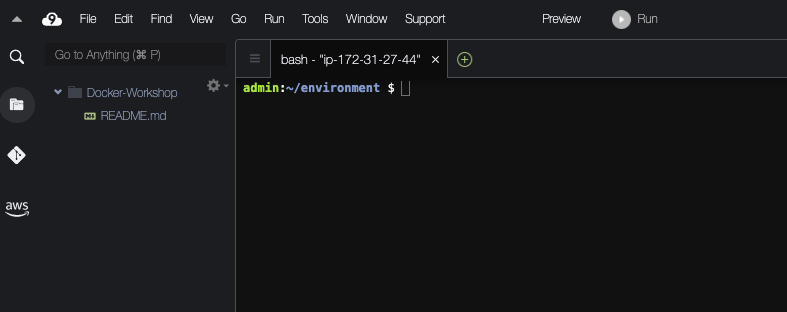
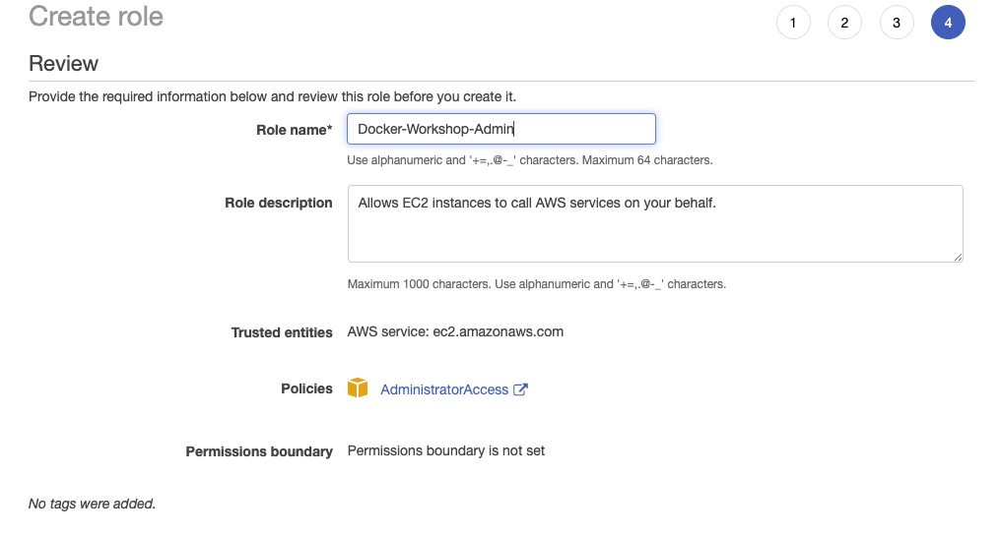
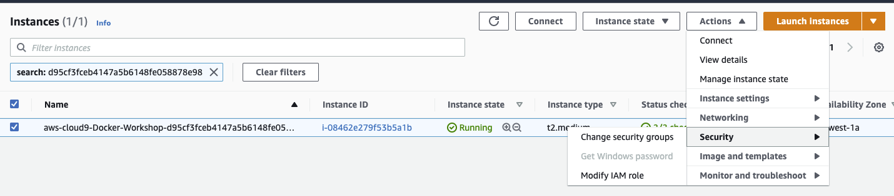
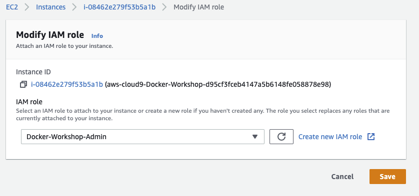
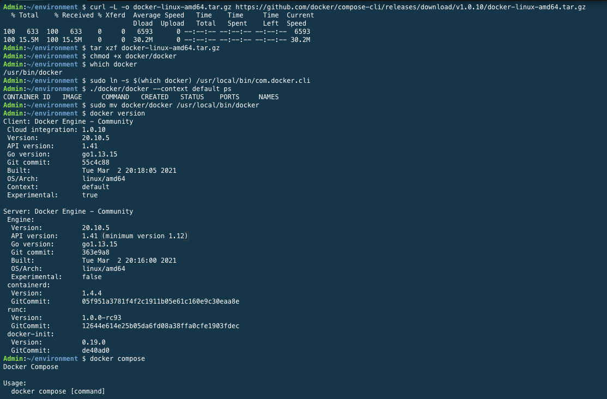

# 전제 조건

# 시작하기
워크샵을 시작하려면 다음 중 하나를 수행하십시오.

# AWS 이벤트
이 워크샵을 완료하려면 AWS Event Engine 서비스를 통해 AWS 계정이 제공됩니다. 이벤트 직원이 팀 해시를 제공합니다.

```
현재 AWS 계정에 로그인되어 있는 경우 다음을 사용하여 로그아웃할 수 있습니다. 링크
```

## AWS 계정 생성
1. 버튼을 클릭하거나 검색하여 포털에 연결합니다.https://dashboard.eventengine.run/. 다음 화면이 나타납니다. 텍스트 상자에 제공된 해시를 입력합니다. 오른쪽 하단에 있는 버튼이 약관 동의 및 로그인 으로 변경됩니다 . 계속하려면 해당 버튼을 클릭하십시오.


```
이벤트 엔진 탭을 열어 둡니다(다음 단계에서 새 탭이 사용됨).
```

2. AWS 콘솔 을 선택한 다음 AWS 콘솔 열기 를 선택합니다 .


3. 이 워크숍 기간 동안 단일 지역을 사용합니다. 이 워크숍은 다음 지역을 지원합니다.

오른쪽 상단에서 미국 동부(버지니아 북부) 를 선택하십시오.



```
이 계정은 워크샵이 끝나면 만료되며 생성된 모든 리소스는 자동으로 프로비저닝 해제됩니다. 오늘 이후에는 이 계정에 액세스할 수 없습니다.
```

## 워크샵을 직접 운영
워크샵을 직접 운영하는 경우에만 이 섹션을 완료하십시오. AWS에서 주최하는 이벤트(예: re:Invent, Kubecon, Immersion Day 등)에 있는 경우 다음으로 이동하십시오.AWS 이벤트에서 워크숍 시작.

## AWS 계정 생성
계정에 새 IAM 역할을 생성하고 다른 IAM 권한의 범위를 지정할 수 있는 기능이 있어야 합니다.

1. 관리자 액세스 권한이 있는 AWS 계정이 아직 없는 경우: 여기를 클릭하여 지금 생성

2. AWS 계정이 있으면 AWS 계정에 대한 관리자 액세스 권한이 있는 IAM 사용자로서 나머지 워크샵 단계를 따르고 있는지 확인하십시오. 워크샵에 사용할 새 IAM 사용자 생성

3. 사용자 세부 정보 입력:



4. AdministratorAccess IAM 정책을 연결합니다.


5. 새 사용자를 만들려면 클릭하십시오.


6. 로그인 URL을 기록해 두고 다음을 저장합니다.


# 작업 공간 만들기

Cloud9 작업 공간은 루트 계정 사용자가 아닌 관리자 권한이 있는 IAM 사용자가 빌드해야 합니다. 루트 계정 사용자가 아닌 IAM 사용자로 로그인했는지 확인하십시오.

이 워크샵은 N.Virginia(us-east-1) 지역 에서 실행하도록 설계되었습니다 . 다른 지역에서 뛰지 마세요. 이 워크샵의 향후 버전은 지역 가용성을 확장할 것이며 이 메시지는 제거될 것입니다.

Cloud9 도메인에 대해 광고 차단기, 자바스크립트 비활성화기 및 추적 차단기를 비활성화해야 합니다. 그렇지 않으면 작업 공간에 연결하는 데 영향을 받을 수 있습니다. Cloud9에는 타사 쿠키가 필요합니다. 당신은 화이트리스트에특정 도메인.

## Cloud9 시작:
Cloud9 환경 생성: https://us-east-1.console.aws.amazon.com/cloud9/home?region=us-east-1

```
Cloud9 환경의 이름을 지정하고 있는지 확인하십시오. Docker-Workshop, 그렇지 않으면 나중에 문제가 발생합니다.
```

1. 환경 만들기 선택
2. 이름을 Docker-Workshop으로 지정 하고 다음 단계를 클릭합니다.
3. 구성에 다음 표를 사용하십시오.

| 환경 설정 | 값 |
| ------- | - |
| 환경 유형 | 우분투 서버 18.04 LTS |
| 인스턴스 유형 | t3.large |
| 플랫폼 | (기본값으로 두십시오) |
| 비용 절감 설정 | (기본값으로 두십시오) |
| IAM 역할 | (기본값으로 두십시오) |

4. 클릭하여 다음 단계를 다음 환경 만들기

5. 그것이 나타나면 환영 탭 과 하단 작업 영역 을 닫고 기본 작업 영역에서 새 터미널 탭을 열어 환경을 사용자 정의하십시오 . 이제 작업 공간이 다음과 같아야 합니다.



이 테마가 마음 에 들면 Cloud9 작업 공간 메뉴에서 보기 / 테마 / Solarized / Solarized Dark 를 선택하여 직접 선택할 수 있습니다 .

# 작업 공간에 대한 IAM 역할 생성

```
여기서부터 아래와 같이 입력해야 하는 명령어가 보이면 Cloud9 IDE에 이러한 명령어를 입력하게 됩니다. 당신이 사용할 수있는 클립 보드에 복사를 단순히 복사 Cloud9에 붙여 넣기 기능 (오른쪽 상단 모서리). 붙여넣으려면 Windows의 경우 Ctrl + V 또는 Mac의 경우 Command + V를 사용할 수 있습니다.
```

1. [이 링크를 사용하여 관리자 액세스 권한이 있는 IAM 역할을 생성합니다](https://console.aws.amazon.com/iam/home#/roles$new?step=review&commonUseCase=EC2%2BEC2&selectedUseCase=EC2&policies=arn:aws:iam::aws:policy%2FAdministratorAccess).

2. AWS 서비스 및 EC2 가 선택 되었는지 확인하고 다음 을 클릭 하여 권한을 봅니다.

3. AdministratorAccess 가 선택 되었는지 확인하고 다음 을 클릭 하여 검토합니다.

4. 이름에 Docker-Workshop-Admin 을 입력 하고 역할 생성을 선택합니다.



# 작업 공간에 IAM 역할 연결

1. [Cloud9 EC2 인스턴스를 찾기 위한 링크](https://console.aws.amazon.com/ec2/v2/home?#Instances:tag:Name=aws-cloud9-.*workshop.*;sort=desc:launchTime)

2. 인스턴스를 선택한 다음 작업 / 보안 / IAM 역할 수정 을 선택합니다.c9인스턴스롤



3. 선택 도커 - 워크샵 - 관리자를 으로부터 IAM 역할 드롭 다운 선택 적용



# 작업 공간에 대한 IAM 설정 업데이트

## Docker Workshop을 위한 작업 공간 구성

```
Cloud9은 일반적으로 IAM 자격 증명을 동적으로 관리합니다. 그러나 이 워크샵의 목적을 위해 임시 토큰이 환경 변수에 있어야 합니다.
```

1. 작업 공간으로 돌아가서 오른쪽 상단 모서리에 있는 톱니바퀴 아이콘을 클릭하거나 새 탭을 열려면 클릭하고 "기본 설정 열기"를 선택하십시오.

2. AWS SETTINGS를 선택 하고 AWS 관리형 임시 자격 증명을 끕니다.

3. 기본 설정 탭 닫기


4. 아래 명령을 복사하여 실행( Ctrl+P 로 붙여넣기 )하십시오. 그것을 실행하기 전에 주석을 읽고 그것이 하는 일을 검토하십시오.

```
  sudo pip install --upgrade awscli && hash -r
  sudo apt update
  sudo apt install jq gettext bash-completion moreutils -y
  rm -vf ${HOME}/.aws/credentials
  export ACCOUNT_ID=$(aws sts get-caller-identity --output text --query Account)
  export STS_RESPONSE=$(aws sts assume-role --role-arn arn:aws:iam::${ACCOUNT_ID}:role/Docker-Workshop-Admin --role-session-name $(uuidgen) --duration-seconds 3600)
  export AWS_ACCESS_KEY_ID=$(echo $STS_RESPONSE | jq .Credentials.AccessKeyId | tr -d \")
  export AWS_SECRET_ACCESS_KEY=$(echo $STS_RESPONSE | jq .Credentials.SecretAccessKey | tr -d \")
  export AWS_SESSION_TOKEN=$(echo $STS_RESPONSE | jq .Credentials.SessionToken | tr -d \")
  export AWS_DEFAULT_REGION=us-east-1
```

# 도커 계정 생성

```
Docker ID가 이미 있는 경우 이 섹션을 건너뛸 수 있습니다.
```

1. [이 단계](https://dockr.ly/31uSAeb)에서 자신을 위한 Docker ID를 생성합니다. "Docker ID 등록" 섹션만 수행하면 됩니다.

2. 향후 단계에서 사용해야 하므로 Docker ID를 근처에 기억하거나 적어 두십시오.

# CLOUD9에서 DOCKER 구성
Cloud9 환경에는 이 워크샵에 필요한 기능이 없는 Docker 버전이 사전 구축되어 있습니다. 아래 단계에 따라 올바른 버전을 설치하고 확인하십시오.

1. Cloud9에서 터미널을 열고 다음을 실행합니다.

```
sudo apt  install jq -y
curl -L -o docker-linux-amd64.tar.gz https://github.com/docker/compose-cli/releases/download/v1.0.10/docker-linux-amd64.tar.gz
tar xzf docker-linux-amd64.tar.gz
chmod +x docker/docker
which docker
sudo ln -s $(which docker) /usr/local/bin/com.docker.cli
./docker/docker --context default ps
sudo mv docker/docker /usr/local/bin/docker
docker version
docker compose
```

다음과 같은 결과를 받아야 합니다.



이제 Cloud9 작업 공간에서 워크숍을 진행하는 데 필요한 모든 단계를 완료했습니다.
