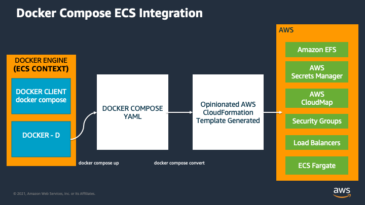
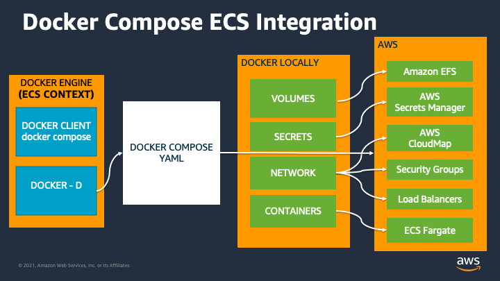
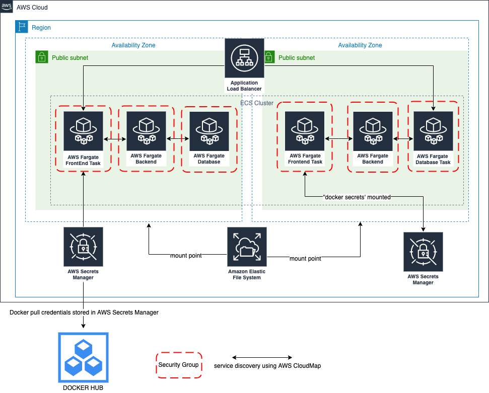

# DOCKER AMAZON ECS 플러그인을 사용하여 AWS에 애플리케이션 배포

## 학습 목표
이제 애플리케이션이 로컬에서 실행되고 있으므로 개발자 환경을 수정하고 동일한 애플리케이션을 사용하지 않고 동일한 애플리케이션을 AWS로 원활하게 마이그레이션하는 방법을 살펴보겠습니다. docker compose명령. 계속 진행하기 전에 Docker Compose용 ECS 플러그인을 활용하는 데 필요한 몇 가지 단계에 대해 이야기하겠습니다.

## 도커 컨텍스트란 무엇입니까?
단일 Docker CLI는 여러 컨텍스트를 가질 수 있습니다 . 각 컨텍스트에는 다른 클러스터 또는 노드를 관리하는 데 필요한 모든 엔드포인트 및 보안 정보가 포함됩니다. docker 컨텍스트 명령을 사용하면 이러한 컨텍스트를 쉽게 구성하고 컨텍스트 간에 전환할 수 있습니다. 예를 들어 회사 랩톱의 단일 Docker 클라이언트는 두 가지 컨텍스트로 구성될 수 있습니다. dev-k8s 및 prod-swarm. dev-k8s에는 개발 환경에서 Kubernetes 클러스터를 구성 및 관리하기 위한 엔드포인트 데이터 및 보안 자격 증명이 포함되어 있습니다. prod-swarm에는 프로덕션 환경에서 Swarm 클러스터를 관리하는 데 필요한 모든 것이 포함되어 있습니다. 이러한 컨텍스트가 구성되면 최상위 도커 컨텍스트 사용을 사용할 수 있습니다. 쉽게 전환할 수 있습니다.

컨텍스트를 이해하는 것이 중요한 또 다른 이유는 ECS에 특정 구성 및 엔드포인트가 포함되어 있으므로 애플리케이션을 ECS에 배포할 수 있도록 특별히 Amazon ECS에 대한 컨텍스트를 생성해야 하기 때문입니다.

### Amazon ECS용 Docker 컨텍스트 생성
컨텍스트는 여러 속성의 조합입니다. 여기에는 다음이 포함됩니다.

이름
엔드포인트 구성
TLS 정보
오케스트레이터

먼저 로컬 머신에 어떤 컨텍스트가 있는지 살펴보겠습니다. 컨텍스트 목록을 보려면 다음 명령을 실행하십시오.

```
$ docker context ls
NAME                TYPE                DESCRIPTION                               DOCKER ENDPOINT               KUBERNETES ENDPOINT                                 ORCHESTRATOR
default *           moby                Current DOCKER_HOST based configuration   unix:///var/run/docker.sock   https://kubernetes.docker.internal:6443 (default)   swarm
```

NS docker context ls명령은 현재 로컬 시스템에 구성된 컨텍스트 목록을 인쇄합니다. 당신은 알아 차릴 것입니다default컨텍스트가 *옆에 있습니다. 이는 모든 Docker 명령이 사용할 현재 컨텍스트임을 나타냅니다.

이제 ECS를 대상으로 하는 데 사용할 수 있는 컨텍스트를 생성하겠습니다. 이렇게 하려면 다음을 사용합니다.docker context create 명령.

```
$ docker context create ecs --help
Create a context for Amazon ECS

Usage:
  docker context create ecs CONTEXT [flags]

Flags:
      --access-keys string   Use AWS access keys from file
      --description string   Description of the context
      --from-env             Use AWS environment variables for profile, or credentials and region
  -h, --help                 Help for ecs
      --local-simulation     Create context for ECS local simulation endpoints
      --profile string       Use an existing AWS profile

Global Flags:
      --config DIRECTORY   Location of the client config files DIRECTORY (default "/Users/anshrma/.docker")
  -c, --context string     context
  -D, --debug              Enable debug output in the logs
  -H, --host string        Daemon socket(s) to connect to
```

보시다시피, docker context create ecs 명령이 걸립니다 CONTEXT매개변수로. NSCONTEXT매개변수는 컨텍스트의 이름을 지정하는 데 사용됩니다. 플래그를 전달하지 않고 기본 명령을 실행해 보겠습니다.

```
$ docker context create ecs ecs-workshop
? Create a Docker context using:  [Use arrows to move, type to filter]
   AWS secret and token credentials
>  AWS environment variables
```

이 명령은 프로필을 제공하지 않았음을 인식하고 사용할 프로필을 선택하거나 새 프로필을 만들도록 요청합니다. 새로 생성해 보겠습니다. 화살표( >)를 이동 하여AWS environment variables 옵션을 선택하고 Enter 키를 누릅니다.

다음을 사용하여 AWS ECS를 사용하도록 컨텍스트를 변경할 수 있습니다. docker context use ecs-workshop.

컨텍스트 목록을 인쇄해 보겠습니다.

```
$ docker context ls
NAME                TYPE                DESCRIPTION                               DOCKER ENDPOINT               KUBERNETES ENDPOINT                                 ORCHESTRATOR
default             moby                Current DOCKER_HOST based configuration   unix:///var/run/docker.sock   https://kubernetes.docker.internal:6443 (default)   swarm
                                                                                         
ecs-workshop *      ecs                 (us-east-1)            
```

이제 us-east-1의 AWS ECS 서비스를 가리키는 도커 컨텍스트가 있습니다. 지금까지 우리는 아직 ECS에 아무 것도 배포하지 않았습니다.

## docker 명령을 사용하여 AWS Secrets Manager에서 보안 암호 생성
### AWS Secrets Manager란 무엇입니까?
AWS Secrets Manager Secrets Manager를 사용하면 암호를 포함하여 코드에서 하드코딩된 자격 증명을 Secrets Manager에 대한 API 호출로 교체하여 프로그래밍 방식으로 암호를 검색할 수 있습니다. 이렇게 하면 암호가 더 이상 코드에 존재하지 않기 때문에 다른 사람이 코드를 검사하는 것에 의해 암호가 손상되지 않도록 하는 데 도움이 됩니다. 또한 지정된 일정에 따라 암호를 자동으로 교체하도록 Secrets Manager를 구성할 수 있습니다. 이를 통해 장기 비밀을 단기 비밀로 교체할 수 있으므로 손상 위험이 크게 줄어듭니다. 여기에는 이 워크샵의 뒷부분에서 사용할 API 키와 OAuth 토큰이 포함됩니다.

### Docker Hub 자격 증명을 사용하여 AWS Secrets Manager에서 보안 암호 생성
라는 이름의 파일 생성 docker-pull-creds.json그리고 그것에 다음을 추가하십시오. Amazon ECS는 이 토큰을 사용하여 Docker Hub에서 이미지를 검색합니다.

```
touch docker-pull-creds.json

{
   "username":"YOUR DOCKERHUB USERID",
   "password":"YOUR DOCKERHUB TOKEN or PASSWORD"
}
```

다음을 실행하여 AWS Secrets Manager에서 보안 암호를 생성하고 ARN(Amazon 리소스 번호)을 환경 변수에 저장합니다.

```
DOCKER_PULL_SECRETS_MANAGER=$(docker secret create pullcredentials docker-pull-creds.json)
echo $DOCKER_PULL_SECRETS_MANAGER
```

다음 섹션에서는 애플리케이션을 Amazon ECS에 배포합니다.

# 1단계: 애플리케이션을 AWS ECS로 마이그레이션
## DOCKER COMPOSE를 사용하여 AWS ECS에 샘플 애플리케이션 배포

### 학습 목표
이 모듈에서는 모듈 1에서 구축한 애플리케이션을 Amazon ECS에 배포합니다. 우리는 같은 것을 사용할 것입니다docker compose명령(개발자 경험을 수정하지 않음). 우리는 기본값을 오버레이합니다docker-compose.yaml ~와 함께 docker-compose.prod.migrate.yaml. Compose 파일 오버레이를 사용하여 특정 환경 배포에 대해 수정해야 하는 항목만 수정합니다.

예를 들어 Module-2에서는 다음을 사용하여 로컬에서 이미지를 구축했습니다. docker compose build 그러나 AWS에 배포하려는 경우 컨테이너 리포지토리에 게시된 이미지를 사용하고 이미지를 ECS로 가져오려고 합니다.

### 오버레이 파일 검사
열려있는 docker-compose.prod.migrate.yaml 내용을 확인하기 위해

```
cat  docker-compose.prod.migrate.yaml 
```

다음 사항에 유의하십시오.

| 속성 작성 | 목적 |
| ------- | --- |
| 서비스.프론트엔드.이미지 | dockerhub에 푸시한 이미지입니다. compose 파일은 이전 모듈에서 설정한 환경 변수를 선택합니다. |
| services.frontend.x-aws-pull_credentials | 안전하게 저장된 dockerhub에서 이미지를 가져오기 위한 자격 증명 AWS 비밀 관리자 우리가 준비에 밀어 넣은 |

## Amazon ECS에 배포
같은 것을 사용 docker compose up Amazon ECS에 배포하는 명령

```
DOCKER_HUB_ID=${DOCKER_HUB_ID} DOCKER_PULL_SECRETS_MANAGER=${DOCKER_PULL_SECRETS_MANAGER} docker compose -f docker-compose.yaml -f  docker-compose.prod.migrate.yaml up
```

docker.compose.yaml에 언급된 services.frontend.image 속성을 docker-compose.prod.migrate.yaml에 언급된 속성과 오버레이하고 있습니다.

```
우리는 또한 환경 변수를 제공했습니다 DOCKER_HUB_ID 그리고 DOCKER_PULL_SECRETS_MANAGER, 작성 파일에서 사용할 수 있도록 합니다. 이 값을 언급하지 않으면invalid reference format 오류.
```

생성되는 AWS 리소스를 관찰할 수 있습니다. 약 10분 안에 모든 리소스가 성공적으로 생성됩니다.

```
$ DOCKER_HUB_ID=${DOCKER_HUB_ID} DOCKER_PULL_SECRETS_MANAGER=${DOCKER_PULL_SECRETS_MANAGER} docker compose -f docker-compose.yaml -f  docker-compose.prod.migrate.yaml up
WARNING services.build: unsupported attribute        
WARNING services.restart: unsupported attribute      
WARNING services.restart: unsupported attribute      
WARNING services.build: unsupported attribute        
WARNING services.restart: unsupported attribute      
[+] Running 34/34
 ⠿ docker-compose-ecs-sample                      CreateComplete 365.7s
 ⠿ Cluster                                        CreateComplete   7.0s
 ⠿ FrontendTCP80TargetGroup                       CreateComplete   1.0s
 ⠿ LogGroup                                       CreateComplete   3.0s
 ⠿ FrontnetNetwork                                CreateComplete   6.0s
 ⠿ BacknetNetwork                                 CreateComplete   6.0s
 ⠿ DbdataFilesystem                               CreateComplete   7.0s
 ⠿ DockercomposeecssampledbpasswordSecret         CreateComplete   3.0s
 ⠿ CloudMap                                       CreateComplete  48.0s
 ⠿ FrontendTaskExecutionRole                      CreateComplete  14.0s
 ⠿ BackendTaskExecutionRole                       CreateComplete  15.0s
 ⠿ DbTaskExecutionRole                            CreateComplete  14.0s
 ⠿ FrontnetNetworkIngress                         CreateComplete   1.0s
 ⠿ BacknetNetworkIngress                          CreateComplete   1.0s
 ⠿ Frontnet80Ingress                              CreateComplete   1.0s
 ⠿ LoadBalancer                                   CreateComplete  93.0s
 ⠿ DbdataNFSMountTargetOnSubnet098a392fcf02dca72  CreateComplete  93.0s
 ⠿ DbdataNFSMountTargetOnSubnet0d065a94a70483f75  CreateComplete  93.0s
 ⠿ DbdataAccessPoint                              CreateComplete   6.0s
 ⠿ DbdataNFSMountTargetOnSubnet0d91e116d3515d9df  CreateComplete  93.0s
 ⠿ DbdataNFSMountTargetOnSubnet07535421cede4e78c  CreateComplete  93.0s
 ⠿ DbdataNFSMountTargetOnSubnet0bac6bf40d80b8767  CreateComplete  93.0s
 ⠿ DbdataNFSMountTargetOnSubnet00446a0ba3673b321  CreateComplete  93.0s
 ⠿ FrontendTaskDefinition                         CreateComplete   3.0s
 ⠿ DbTaskRole                                     CreateComplete  14.0s
 ⠿ BackendTaskDefinition                          CreateComplete   3.0s
 ⠿ DbTaskDefinition                               CreateComplete   3.0s
 ⠿ FrontendServiceDiscoveryEntry                  CreateComplete   3.0s
 ⠿ BackendServiceDiscoveryEntry                   CreateComplete   3.0s
 ⠿ DbServiceDiscoveryEntry                        CreateComplete   3.0s
 ⠿ FrontendTCP80Listener                          CreateComplete   2.0s
 ⠿ DbService                                      CreateComplete  90.0s
 ⠿ BackendService                                 CreateComplete  67.2s
 ⠿ FrontendService                                CreateComplete                              
```

Docker Compose는 모두 AWS Well Architected 원칙을 준수하는 AWS 리소스 생성에 대한 의견을 가지고 있음을 알 수 있습니다. 모든 리소스는 이 실습의 기본 VPC에 배포되었습니다. 실제 시나리오에서는 다음을 사용하여 자체 VPC 및 서브넷에 배포할 수 있습니다.x-aws-vpc 확장자(docker-compose.prod.migrate.yaml에 주석 처리됨).

Docker Compose CLI는 먼저 전달된 작성 파일을 연결하고 의견이 있는 파일을 생성합니다. AWS 클라우드 포메이션템플릿을 만들고 배포하여 작성 파일에 정의된 AWS 리소스를 생성합니다. 당신은 실행할 수 있습니다docker compose convert 생성된 AWS Cloudformation 템플릿을 보려면 명령을 실행합니다.

```
$ DOCKER_HUB_ID=${DOCKER_HUB_ID} DOCKER_PULL_SECRETS_MANAGER=${DOCKER_PULL_SECRETS_MANAGER} docker compose -f docker-compose.yaml -f  docker-compose.prod.migrate.yaml convert > aws-cloudformation.yaml
WARNING services.build: unsupported attribute        
WARNING services.restart: unsupported attribute      
WARNING services.restart: unsupported attribute      
WARNING services.build: unsupported attribute        
WARNING services.restart: unsupported attribute 
cat aws-cloudformation.yaml
```

생성된 AWS Cloudformation 템플릿은 aws-cloudformation.yaml 우리가 코딩한 적이 없는 약 650개 이상의 코드 라인이 있지만 로컬 개발에 사용한 것과 동일한 작성 파일이 ECS 컨텍스트에서 생성되어 일관된 개발자 경험을 유지합니다.

다음에서 전체 CloudFormation 스택을 볼 수 있습니다. https://console.aws.amazon.com/cloudformation/home?region=us-east-1#/stacks?filteringStatus=active&filteringText=&viewNested=true&hideStacks=false



다음은 compose CLI에서 생성된 해당 AWS 리소스입니다.

| 현지 | 생성된 AWS 리소스 | 목적 | 추가 정보 |
| --- | -------------- | --- | ------ |
| 도커 볼륨 | AWS 탄력적 파일 시스템 | 상태 저장 스토리지 | https://docs.docker.com/cloud/ecs-integration/#volumes |
| 도커 네트워크 | 보안 그룹 | 서비스 격리 | https://docs.docker.com/cloud/ecs-integration/#service-isolation |
| 도커 비밀 | AWS 비밀 관리자 | 보안 비밀 저장소 | https://docs.docker.com/cloud/ecs-integration/#secrets |
| 도커 서비스 | 아마존 ECS 서비스 그리고 로드 밸런서 | |
| Compose의 네트워킹 | AWS 클라우드맵 | 서비스 발견	https://docs.docker.com/cloud/ecs-integration/#service-discovery |

로컬과 비교할 때 AWS에서 애플리케이션이 어떻게 보이는지 시각화하려면



아래는 aws의 애플리케이션 아키텍처입니다.



운영 docker compose psAWS에서 생성된 관련 서비스 목록을 보려면 . 프런트엔드의 로드 밸런서 URL을 기록해 둡니다.

```
$ docker compose ps
NAME                                                              SERVICE             STATUS              PORTS
task/docker-compose-ecs-sample/03edab2b86bf4908848dc110783534ca   frontend            Running             docke-LoadB-1CUH2S15TOP3G-9f4a862f40ce307b.elb.us-east-1.amazonaws.com:3000->3000/tcp
task/docker-compose-ecs-sample/b1c2b46cbb7a49cc91accc7dd11d792d   db                  Running             
task/docker-compose-ecs-sample/dd137043522843fe8ba85392f3b1175e   backend             Running  
```

애플리케이션에 액세스하려면 위에서 언급한 URL에 액세스하십시오. Module-1에서 로컬로 액세스한 것과 유사하게 애플리케이션에 액세스합니다. 모든 브라우저에서 또는 curl을 사용하여 액세스할 수 있습니다.

애플리케이션 로드(위 단계의 프론트엔드 엔드포인트 URL에서 대체)

```
http://docke-LoadB-1CUH2S15TOP3G-9f4a862f40ce307b.elb.us-east-1.amazonaws.com:3000
```

데이터베이스에 레코드 삽입(위 단계의 프런트엔드 엔드포인트 URL에서 교체)

```
http://docke-LoadB-1CUH2S15TOP3G-9f4a862f40ce307b.elb.us-east-1.amazonaws.com:3000/add/2/name2
http://docke-LoadB-1CUH2S15TOP3G-9f4a862f40ce307b.elb.us-east-1.amazonaws.com:3000/add/3/name3
http://docke-LoadB-1CUH2S15TOP3G-9f4a862f40ce307b.elb.us-east-1.amazonaws.com:3000/add/4/name4
```

당신은 실행할 수 있습니다 docker compose logs AWS ECS 서비스에서 로그를 스트리밍합니다.

```
docker compose logs

Db_Secrets_InitContainer  | 2021-03-15T22:35:36.507325Z 0 [System] [MY-010931] [Server] /usr/sbin/mysqld: ready for connections. Version: '8.0.19'  socket: '/var/run/mysqld/mysqld.sock'  port: 3306  MySQL Community Server - GPL.
Db_Secrets_InitContainer  | 2021-03-15T22:35:36.628015Z 0 [System] [MY-011323] [Server] X Plugin ready for connections. Socket: '/var/run/mysqld/mysqlx.sock' bind-address: '::' port: 33060
Backend_Secrets_InitContainer  |  * Serving Flask app "hello.py"
Backend_Secrets_InitContainer  |  * Environment: production
Backend_Secrets_InitContainer  |    WARNING: This is a development server. Do not use it in a production deployment.
Backend_Secrets_InitContainer  |    Use a production WSGI server instead.
Backend_Secrets_InitContainer  |  * Debug mode: off
Backend_Secrets_InitContainer  |  * Running on http://0.0.0.0:5000/ (Press CTRL+C to quit)
Backend_Secrets_InitContainer  | 172.31.55.66 - - [15/Mar/2021 22:38:18] "GET / HTTP/1.0" 200 -
frontend                       | 172.31.58.77 - - [15/Mar/2021:22:38:18 +0000] "GET / HTTP/1.1" 200 26 "-" "ELB-HealthChecker/2.0" "-"
```

# 2단계: ECS에서 현대화
# DOCKER COMPOSE를 사용하여 샘플 애플리케이션을 AWS ECS로 현대화

## 학습 목표
이제 애플리케이션을 AWS로 마이그레이션하고 AWS에서 성공적으로 실행했으므로 동일한 docker compose 명령줄 인터페이스를 사용하여 개발자 환경을 수정하지 않고 다시 한 걸음 더 나아가 현대화를 시작하겠습니다. 전체 목록 및 Docker Compose-ECS 매핑은 다음을 참조하십시오.여기 그리고 예

이 단계에서는 다음을 수행합니다.

AWS Fargate 작업에 대해 AutoScaling 활성화
컨테이너 대신 AWS RDS(관계형 데이터베이스 시스템)에서 호스팅되는 MQSQL 데이터베이스를 사용합니다.

## AWS Fargate란 무엇입니까?
AWS Fargate는 Amazon Elastic Container Service(ECS) 및 Amazon Elastic Kubernetes Service(EKS)와 함께 작동하는 컨테이너용 서버리스 컴퓨팅 엔진입니다. Fargate를 사용하면 애플리케이션 구축에 집중할 수 있습니다. Fargate를 사용하면 서버를 프로비저닝 및 관리할 필요가 없고, 애플리케이션별로 리소스를 지정하고 비용을 지불할 수 있으며, 설계에 따른 애플리케이션 격리를 통해 보안이 향상됩니다.

## AWS Fargate 작업에 대해 Autoscaling 활성화
검사 docker-compose.prod.scaling.yaml. 이 작성 파일은 나머지 두 개와 오버레이되면 다음을 수행합니다.

services.backend.deploy.replicas를 사용하여 지정된 대로 백엔드 서비스에 대해 정적 복제본 수를 2로 늘립니다. 이것만으로는 서비스가 자동 확장되지 않습니다.

x-aws-autoscaling 사용자 지정 확장을 사용하여 자동 크기 조정 범위를 정의하고 CPU 또는 메모리를 사용하여 리소스 사용량 백분율로 표시되는 대상 지표를 정의합니다. 이렇게 하면 CPU 임계값이 5분 동안 75%에 도달할 때마다 작업 수를 1씩 늘려 서비스를 확장합니다.

```
services:
backend:
cap_add: 
  - SYS_PTRACE
deploy:
  replicas: 2
  # resources:
  #   limits:
  #     memory: 2Gb
  #     cpus: '0.5'
  x-aws-autoscaling:
      min: 2
      max: 10 #required
      cpu: 75
```

## 컨테이너 대신 AWS RDS(관계형 데이터베이스 시스템)에서 호스팅되는 MQSQL 데이터베이스 사용
검사 x-aws-cloudformation 아래의 docker-compose.prod.scaling.yaml. x-aws-cloudformationAWS CloudFormation을 사용하여 AWS 리소스를 생성할 수 있는 docker compose용 사용자 지정 확장입니다. 우리의 경우 이 확장을 사용하여 다음 리소스를 생성합니다.

| x-aws-cloudformation 속성 | 목적 |
| ------------------------ | --- |
| DB보안그룹 | 수신 규칙/CIDR 블록을 정의하는 보안 그룹입니다. 우리는 기본값을 지정하고 있습니다VPC CIDR 블록 |
| RDSInstanceSecret | AWS Secrets Manager에 안전하게 저장된 RDS 데이터베이스에 연결하기 위한 사용자 이름과 암호를 생성합니다. |
| MySQL | RDS MySQL 8.0.16 데이터베이스 생성 |

## 업데이트 시작
compose 속성을 추가 및 수정하고 AWS 리소스를 생성/업데이트하는 다음 명령을 실행합니다.

```
DOCKER_HUB_ID=${DOCKER_HUB_ID} DOCKER_PULL_SECRETS_MANAGER=${DOCKER_PULL_SECRETS_MANAGER} docker compose -f docker-compose.yaml -f  docker-compose.prod.migrate.yaml -f docker-compose.prod.scaling.yaml up
```

완료하는 데 약 10-15분이 소요됩니다. 에서 진행 상황을 볼 수 있습니다.https://console.aws.amazon.com/cloudformation/home?region=us-east-1#/stacks?filteringStatus=active&filteringText=&viewNested=true&hideStacks=false

```
DOCKER_HUB_ID=${DOCKER_HUB_ID} DOCKER_PULL_SECRETS_MANAGER=${DOCKER_PULL_SECRETS_MANAGER} docker compose -f docker-compose.yaml -f  docker-compose.prod.migrate.yaml -f docker-compose.prod.scaling.yaml up
WARNING services.build: unsupported attribute        
WARNING services.restart: unsupported attribute      
WARNING services.restart: unsupported attribute      
WARNING services.build: unsupported attribute        
WARNING services.restart: unsupported attribute      
[+] Running 0/0
 ⠋ docker-compose-ecs-sample                      UpdateInProgress User Initiated                               0.0s
 ⠋ Cluster CreateComplete         0.0s
 ⠋ BacknetNetwork                                 CreateComplete         0.0s
 ⠋ LogGroup                                       CreateComplete         0.0s
 ⠋ DbdataAccessPoint                              CreateComplete         0.0s
 ⠋ FrontendTCP80TargetGroup                       CreateComplete         0.0s
 ⠋ CloudMap                                       CreateComplete         0.0s
 ⠋ DockercomposeecssampledbpasswordSecret         CreateComplete         0.0s
 ⠋ FrontendTaskExecutionRole                      CreateComplete         0.0s
 ⠋ FrontnetNetwork                                CreateComplete         0.0s
 ⠋ BackendTaskExecutionRole                       CreateComplete         0.0s
 ⠋ DbTaskExecutionRole                            CreateComplete         0.0s
 ⠋ FrontnetNetworkIngress                         CreateComplete         0.0s
 ⠋ Frontnet80Ingress                              CreateComplete         0.0s
 ⠋ DbdataNFSMountTargetOnSubnet00446a0ba3673b321  CreateComplete         0.0s
 ⠋ DbdataNFSMountTargetOnSubnet0bac6bf40d80b8767  CreateComplete         0.0s
 ⠋ DbdataNFSMountTargetOnSubnet07535421cede4e78c  CreateComplete         0.0s
 ⠋ DbdataNFSMountTargetOnSubnet098a392fcf02dca72  CreateComplete         0.0s
 ⠋ DbdataNFSMountTargetOnSubnet0d065a94a70483f75  CreateComplete         0.0s
 ⠋ LoadBalancer                                   CreateComplete         0.0s
 ⠋ DbdataNFSMountTargetOnSubnet0d91e116d3515d9df  CreateComplete         0.0s
 ⠋ BacknetNetworkIngress                          CreateComplete         0.0s
 ⠋ DbTaskRole                                     CreateComplete         0.0s
 ⠋ FrontendTaskDefinition                         CreateComplete         0.0s
 ⠋ BackendTaskDefinition                          CreateComplete         0.0s
 ⠋ DbTaskDefinition                               CreateComplete         0.0s
 ⠋ BackendServiceDiscoveryEntry                   CreateComplete         0.0s
 ⠋ DbServiceDiscoveryEntry                        CreateComplete         0.0s
 ⠋ FrontendServiceDiscoveryEntry                  CreateComplete         0.0s
 ⠋ FrontendTCP80Listener                          CreateComplete         0.0s
 ⠋ DbService                                      CreateComplete         0.0s
 ⠋ BackendService                                 CreateComplete         0.0s
 ⠋ FrontendService                                CreateComplete       
```

완료되면 다음으로 이동하십시오. https://console.aws.amazon.com/rds/home?region=us-east-1#databases:생성된 RDS 데이터베이스를 봅니다. RDS 끝점 및 포트를 기록해 둡니다.
Secrets Manager로 이동하여 데이터베이스에 연결하기 위한 자격 증명을 검색합니다. https://console.aws.amazon.com/secretsmanager/home?region=us-east-1#!/secret?name=RDSInstanceSecret

이 워크숍의 목적을 위해 AWS CloudFormation을 쿼리하고 RDS 데이터베이스 엔드포인트와 Secrets Manager ARN을 환경 변수로 설정하여 작성 파일에서 선택할 수 있도록 합니다.

```
RDS_ENDPOINT=$(aws cloudformation describe-stacks --stack-name docker-compose-ecs-sample --query Stacks[0].Outputs[0].OutputValue | tr -d \")
RDS_DB_SECRET_ARN=$(aws cloudformation describe-stack-resource --stack-name docker-compose-ecs-sample --logical-resource-id RDSInstanceSecret --query StackResourceDetail.PhysicalResourceId | tr -d \")
```

이제 다음을 실행하여 이러한 리소스를 백엔드 애플리케이션에 바인딩할 수 있습니다.

```
DOCKER_HUB_ID=${DOCKER_HUB_ID} DOCKER_PULL_SECRETS_MANAGER=${DOCKER_PULL_SECRETS_MANAGER} RDS_ENDPOINT=${RDS_ENDPOINT} RDS_DB_SECRET_ARN=${RDS_DB_SECRET_ARN} docker compose -f docker-compose.yaml -f  docker-compose.prod.migrate.yaml -f docker-compose.prod.scaling.yaml -f docker-compose.prod.rds.yaml up
```

우리가 방금 무엇을 했습니까? cat docker-compose.prod.rds.yaml 파일을 검사하기 위해

환경 변수에 RDS 데이터베이스 끝점을 설정하고 작성 파일에 전달했습니다.
환경 변수에 AWS Secrets Manager 식별자(실제 암호가 아님)를 설정하고 작성 파일에 전달했습니다.
docker compose가 자동으로 전달됨 비밀 에 지정된 docker-compose.prod.rds.yaml secrets.db-password.name 아래에 백엔드 애플리케이션에 마운트되어 애플리케이션이 컨테이너 대신 RDS 데이터베이스에 연결되도록 합니다.
동일한 애플리케이션 엔드포인트를 실행할 수 있지만 대신 요청이 RDS 인스턴스로 이동하기 시작합니다.

## 대청소
운영 docker compose down cloudformation 템플릿을 삭제하여 ECS 환경을 해체합니다.

```
Admin:~/environment/docker-compose-ecs-sample (main) $ docker compose down
[+] Running 11/13
 ⠸ docker-compose-ecs-sample      DeleteInProgress User Initiated                                                                                                                                                          246.4s
 ⠿ FrontendService                DeleteComplete          228.0s
 ⠿ DefaultNetworkIngress          DeleteComplete            1.0s
 ⠿ Frontnet3000Ingress            DeleteComplete            1.0s
 ⠿ BacknetNetworkIngress          DeleteComplete            1.0s
 ⠿ FrontnetNetworkIngress         DeleteComplete            1.0s
 ⠿ FrontendTCP3000Listener        DeleteComplete            1.0s
 ⠿ FrontendTaskDefinition         DeleteComplete            2.0s
 ⠸ BackendService                 DeleteInProgress         15.4s
 ⠿ FrontendServiceDiscoveryEntry  DeleteComplete            1.0s
 ⠿ FrontendTCP3000TargetGroup     DeleteComplete            1.0s
 ⠿ LoadBalancer                   DeleteComplete            1.0s
 ⠿ FrontendTaskExecutionRole      DeleteComplete            2.0s
```
