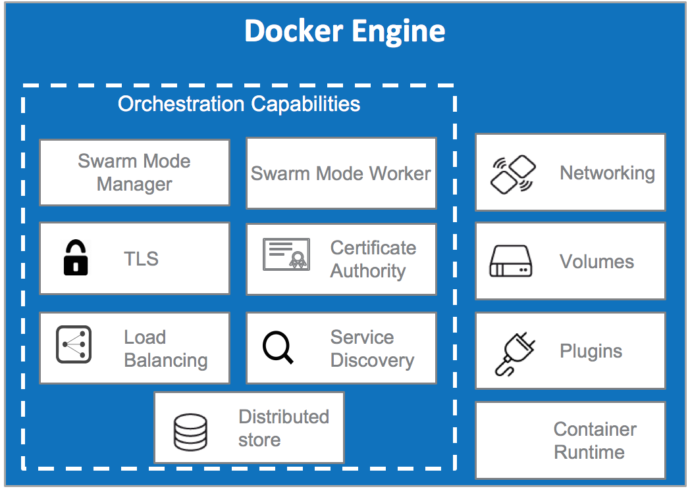
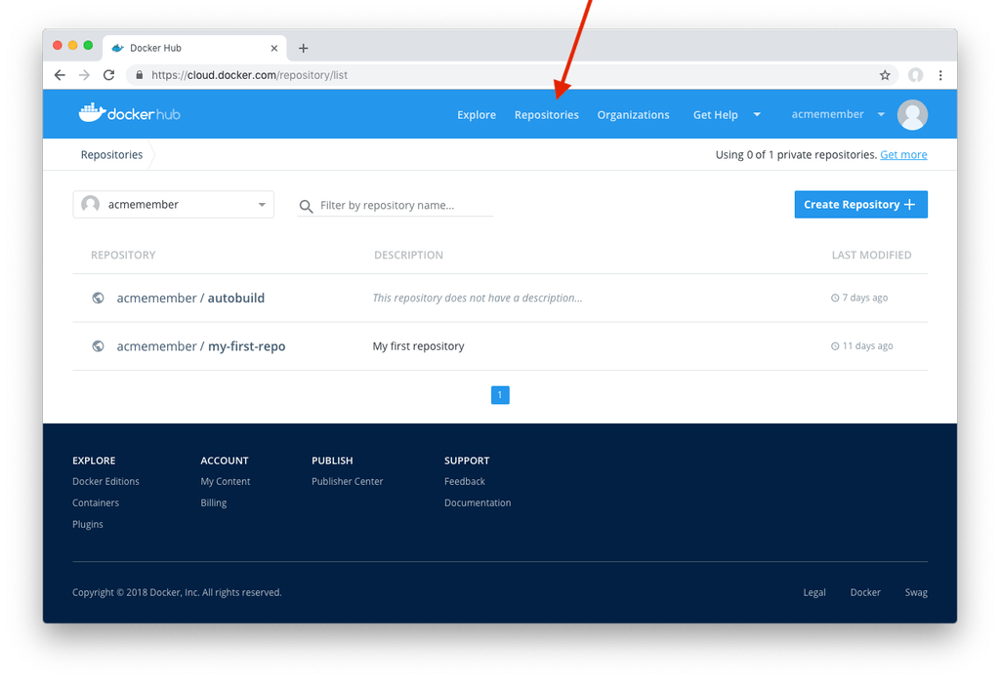
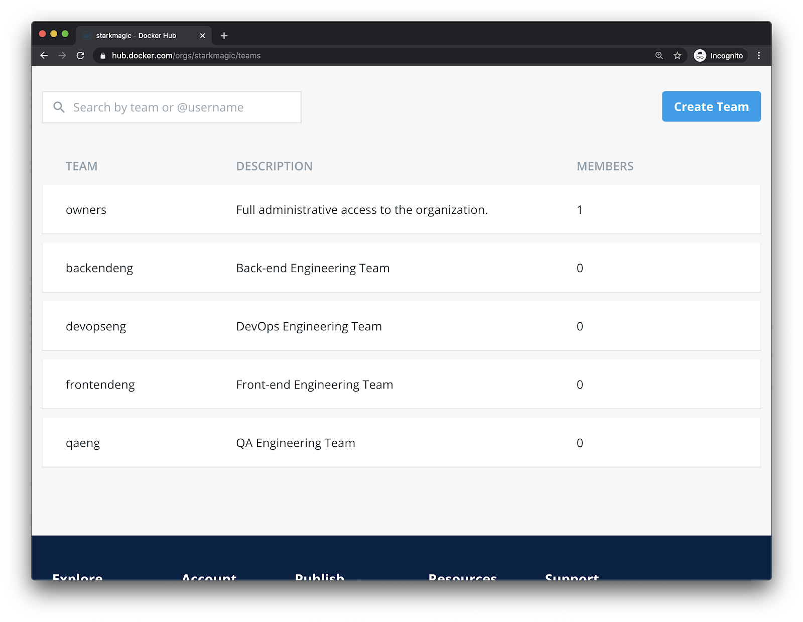
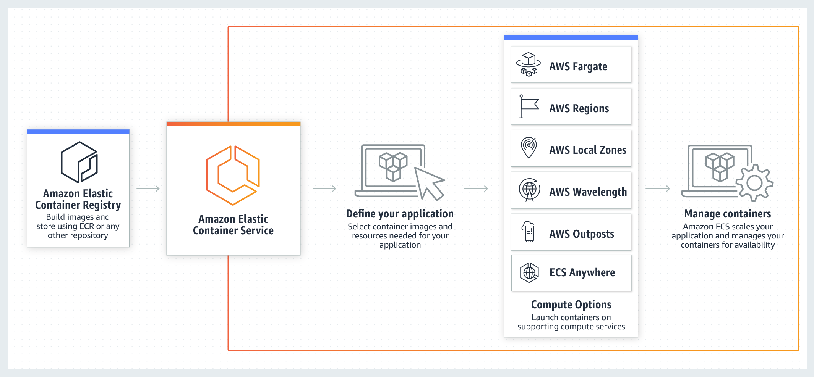

# 워크샵 개요

## 워크샵 개요

워크샵 경험을 최대한 활용하기 위해 Docker가 컨테이너화 분야의 리더인 이유를 이해하기 위한 기초를 설정하겠습니다. 이 섹션에서는 가상 머신과 컨테이너 간의 차이점에 대해 논의하여 이 워크샵에 대한 자세한 내용을 제공합니다.

### 컨테이너란 무엇이며 컨테이너를 사용하면 어떻게 애플리케이션을 보다 효율적으로 관리하고 배포할 수 있습니까?

컨테이너는 애플리케이션이 한 컴퓨팅 환경에서 다른 컴퓨팅 환경으로 빠르고 안정적으로 실행될 수 있도록 코드와 모든 종속성을 패키지화하는 소프트웨어의 표준 단위입니다. 컨테이너 이미지는 코드, 런타임, 시스템 도구, 시스템 라이브러리, 설정 등 애플리케이션을 실행하는 데 필요한 모든 것을 포함하는 가벼운 독립 실행형 실행 소프트웨어 패키지입니다. 이를 통해 개발자는 동료가 코드를 실행하는 데 사용할 수 있는 다양한 종속성에 대해 걱정할 필요 없이 단순히 모든 코드와 해당 종속성을 컨테이너에 패키징하여 생산성을 유지하는 데 필요한 모든 것을 가질 수 있기 때문에 생산성을 높일 수 있습니다. .

### 가상 머신(VM)과 컨테이너의 차이점은 무엇입니까?

컨테이너와 가상 머신은 리소스 격리 및 할당 이점이 비슷하지만 컨테이너 가 하드웨어 대신 운영 체제를 가상화하기 때문에 다르게 작동합니다 . 이러한 이유로 컨테이너는 더 휴대 가능하고 효율적이며 컨테이너와 가상 머신 간의 차이점을 더 잘 이해할 수 있도록 하여 둘을 비교하여 살펴보겠습니다.

### 가상 머신(VM)

가상 머신(VM)은 하나의 서버를 여러 서버로 바꾸는 물리적 하드웨어의 추상화입니다. 하이퍼바이저를 사용하면 단일 시스템에서 여러 VM을 실행할 수 있습니다. 각 VM에는 운영 체제, 애플리케이션, 필요한 바이너리 및 라이브러리의 전체 복사본이 포함되어 있으며 수십 GB를 차지합니다. VM은 부팅 속도가 느릴 수도 있습니다. 아래 다이어그램은 가상 머신을 실행하는 모습을 시각적으로 보여줍니다.


### 컨테이너

컨테이너는 코드와 종속성을 함께 패키징하는 앱 계층의 추상화입니다. 여러 컨테이너가 동일한 시스템에서 실행될 수 있고 OS 커널을 다른 컨테이너와 공유할 수 있으며, 각각은 사용자 공간에서 격리된 프로세스로 실행됩니다. 컨테이너는 VM보다 공간을 덜 차지하고(컨테이너 이미지의 크기는 일반적으로 수십 MB임) 더 많은 애플리케이션을 처리할 수 있으며 더 적은 수의 VM 및 운영 체제가 필요합니다.


### 요약

여기서 중요한 점 은 개발자로서 효과적인 작업을 수행하기 위해 애플리케이션 및 하드웨어 종속성의 무거운 작업 을 추상화 하여 다음과 같은 이점을 얻을 수 있다는 것입니다.

향상된 효율성

생산성 향상

간소화된 거래

비용 절감

민첩성 증가

또한 문제는 컨테이너를 사용해야 하는지 가상 머신을 사용해야 하는지가 아니라 애플리케이션을 배포하고 관리할 때 더 많은 유연성을 제공하기 위해 두 가지 모두를 어떻게 활용할 수 있느냐 하는 것입니다. 주요 목표는 개발자 팀의 민첩성을 높이는 것이어야 하며 현실적으로 말해서 조직은 이러한 목표를 달성하기 위해 두 가지를 모두 활용하는 방법을 이해해야 합니다.

다음 섹션에서는 Docker 아키텍처를 자세히 살펴보고 Docker를 컨테이너화된 애플리케이션을 빌드, 관리 및 배포하는 데 가장 널리 사용되는 솔루션으로 만든 다양한 구성 요소에 대해 설명합니다.

## 도커 엔진

이전 섹션에서는 가상 머신과 컨테이너 간의 몇 가지 주요 차이점을 이해하고 컨테이너가 무엇인지 이해하기 위한 기초를 설정했습니다. 이 섹션에서는 Docker가 컨테이너 구축 및 배포 프로세스를 단순화하는 방법을 구체적으로 자세히 살펴보겠습니다.

Docker가 컨테이너 공간에서 업계 리더인 주요 이유 중 하나는 Docker가 Docker Engine에서 실행되는 컨테이너 내부의 모든 애플리케이션 종속성을 번들로 묶는 간단한 도구 및 범용 패키징 접근 방식을 생성하기 때문입니다.

### 도커 엔진이란?

Docker 엔진을 사용하면 컨테이너화된 애플리케이션을 모든 인프라에서 일관되게 실행할 수 있으므로 개발자 및 운영 팀의 종속성 문제를 해결하고 "내 노트북에서 작동합니다!" 문제. Docker 엔진은 사용자가 컨테이너로 작업할 때 최대한 효율적으로 작업할 수 있도록 지원하는 전체 기능 및 도구 세트를 포함합니다. Docker 엔진이 제공하는 세 가지 주요 기능은 다음과 같이 요약할 수 있습니다.

단순성, 견고성 및 이식성에 중점을 둔 업계 표준 컨테이너 런타임인 containerd로 구동

Docker Engine에서 가장 많이 사용되는 Docker 기능인 Buildkit 과의 통합 . Docker Buildkit은 주로 Dockerfile에서 이미지를 빌드하는 데 사용됩니다(모듈 2에서 자세히 설명).

이 워크샵 전체에서 강조될 Docker CLI 의 단순성과 접근성

즉각적인 비즈니스 가치 제공 측면에서 Docker 엔진은 모든 규모의 기업이 다음 세 가지 이점을 달성할 수 있도록 지원합니다.

Docker 엔진이 Docker Enterprise 플랫폼의 기본 공통 기반을 형성하므로 혁신을 가속화하여 개발자와 운영자가 코드를 더 빠르고 효율적으로 개발 및 제공할 수 있는 기능을 제공하여 아이디어를 빠르고 안전하게 현실로 전환할 수 있습니다.

Docker 엔진이 모든 유형의 애플리케이션을 지원하므로 개발자 및 운영 팀에게 선택의 자유를 제공합니다. 레거시 애플리케이션, 클라우드 네이티브, 모놀리식, 12팩터 애플리케이션은 물론 모든 클라우드 제공업체의 여러 운영 체제에서도 작동합니다. Docker Engine은 Kubernetes CRI와 함께 작동하도록 검증되었습니다.

Docker 엔진은 보안을 염두에 두고 구축되었기 때문에 철저한 보안을 제공합니다. Docker Content Trust 및 FIPS 140-2 검증을 통해 Docker Engine 사용자는 고도로 규제된 환경에서 컨테이너화된 애플리케이션을 실행할 수 있습니다.

### 도커 엔진 개요



내부적으로 Docker Engine은 다음과 같은 주요 구성 요소가 있는 클라이언트-서버 애플리케이션입니다.

데몬 프로세스(dockerd 명령)라고 하는 장기 실행 프로그램 유형인 서버.

프로그램이 데몬과 대화하고 수행할 작업을 지시하는 데 사용할 수 있는 인터페이스를 지정하는 REST API입니다.

CLI(명령줄 인터페이스) 클라이언트(docker 명령).

CLI는 Docker REST API를 사용하여 스크립팅 또는 직접 CLI 명령을 통해 Docker 데몬을 제어하거나 상호 작용합니다. 다른 많은 Docker 애플리케이션은 기본 API 및 CLI를 사용합니다.

데몬은 이미지, 컨테이너, 네트워크 및 볼륨과 같은 Docker 개체를 만들고 관리합니다.

이 섹션에서 언급한 다양한 기술에 대해 자세히 알아보기 위해 추가 교육을 위한 링크를 추가했습니다.

https://containerd.io/ - containerd에 대해 자세히 알아보려면

https://docs.docker.com/engine/ - Docker 엔진에 대해 자세히 알아보기 위한 문서

https://docs.docker.com/develop/develop-images/build\_enhancements/ - Docker Buildkit 사용을 위한 시작 가이드

다음 섹션에서는 컨테이너 이미지가 무엇인지 그리고 이것이 Docker 이미지가 무엇인지 이해하는 데 어떻게 도움이 되는지 배울 것입니다.

## 도커 이미지

### 컨테이너 이미지란 무엇입니까?

컨테이너 이미지는 컨테이너 생성 지침이 있는 읽기 전용 템플릿입니다. 이미지에는 코드를 실행해야 하는 라이브러리 및 종속성에 대한 정의를 포함하여 실행할 코드가 포함되어 있습니다. 종종 이미지는 몇 가지 추가 사용자 정의가 포함된 다른 이미지를 기반으로 합니다. 이러한 이미지는 하나의 단일 블록이 아니라 여러 레이어 로 구성되어 있다는 점에 유의하는 것이 중요합니다 . 이 섹션에서 이것이 의미하는 바에 대해 알아보겠습니다.

### Dockerfile 및 Docker 이미지

이제 컨테이너 이미지가 무엇인지에 대한 일반적인 개념을 이해했으므로 Dockerfile이라고도 하는 Docker 이미지에 이것이 어떻게 적용되는지 살펴보겠습니다. 위에서 언급한 컨테이너 이미지와 마찬가지로 Dockerfiles 및 Docker 이미지는 이식 가능한 런타임 애플리케이션 환경을 제공하고 애플리케이션과 종속성을 단일의 변경할 수 없는 아티팩트로 패키징하고 사용자에게 다른 애플리케이션 버전을 동시에 실행할 수 있는 옵션을 제공하며 더 빠른 개발 및 배포 주기를 제공합니다. .

### Docker 컨테이너 이미지의 계층화된 아키텍처

Docker 컨테이너 이미지는 계층화된 아키텍처로 알려진 것을 따릅니다. 다음은 기본 Dockerfile의 예이며 계층화된 아키텍처가 실제로 무엇을 의미하는지 분석해 보겠습니다. Docker 이미지는 일련의 레이어로 구성됩니다. 각 계층은 이미지의 Dockerfile에 있는 명령을 나타냅니다. 맨 마지막 레이어를 제외한 각 레이어는 읽기 전용입니다. 다음 Dockerfile을 고려하십시오.

```
FROM ubuntu:15.04
COPY . /app
RUN make /app
CMD python /app/app.py
```

이 Dockerfile에는 각각 레이어를 생성하는 4개의 명령이 포함되어 있습니다. FROM 문은 ubuntu:15.04 이미지에서 레이어를 생성하여 시작합니다. COPY 명령은 Docker 클라이언트의 현재 디렉터리에서 일부 파일을 추가합니다. RUN 명령은 make 명령을 사용하여 애플리케이션을 빌드합니다. 마지막으로 마지막 계층은 컨테이너 내에서 실행할 명령을 지정합니다.

각 레이어는 이전 레이어와의 차이점 집합일 뿐입니다. 레이어는 서로의 위에 쌓입니다. 새 컨테이너를 만들 때 기본 레이어 위에 새 쓰기 가능한 레이어를 추가합니다. 이 레이어를 종종 "컨테이너 레이어"라고 합니다. 새 파일 쓰기, 기존 파일 수정 및 파일 삭제와 같이 실행 중인 컨테이너에 대한 모든 변경 사항은 쓰기 가능한 이 얇은 컨테이너 계층에 기록됩니다. 아래 다이어그램은 Ubuntu 15.04 이미지를 기반으로 하는 컨테이너를 보여줍니다.


Dockerfile에서 무언가를 변경하고 이미지를 다시 빌드하면 어떻게 될까요? Dockerfile을 사용하여 컨테이너 이미지를 빌드할 때의 주요 이점 중 하나는 수정된 레이어 만 다시 빌드 된다는 것 입니다. 이것이 컨테이너 이미지를 다른 가상화 기술에 비해 가볍고 작고 빠르게 만드는 이유입니다.

### 요약

Dockerfile은 Docker 이미지를 빌드하고 실행할 때 진실의 근원입니다. Dockerfile은 빌드할 때 Docker 이미지를 생성하는 생성하는 아티팩트입니다. Dockerfile에는 해당 이미지를 빌드하는 방법과 해당 이미지에 포함해야 하는 내용에 대한 지침이 포함되어 있습니다. Dockerfiles에 대해 생각하는 가장 좋은 방법은 좋아하는 음식을 요리하기 위해 지시를 따르는 것과 다르지 않다는 것입니다. Dockerfile에는 컨테이너 이미지를 빌드하는 방법에 대한 단계별 지침이 포함되어 있습니다. 예는 Node.js의 특정 버전을 가져오거나 다음과 같은 프로그램을 설치하는 지침을 포함할 수 있습니다.jq 따라서 컨테이너를 실행할 때 필요한 모든 것을 갖게 되며 컨테이너를 올바르게 실행하는 데 필요한 도구나 종속성을 수동으로 설치할 필요가 없습니다.

Dockerfile에 나와 있는 지침에 따라 Docker 이미지를 빌드했으면 다음 단계는 해당 이미지를 Docker Hub와 같은 이미지 리포지토리로 푸시하는 것입니다(다음 섹션에서 이것이 의미하는 바에 대해 논의함). 그런 다음 선택할 수 있습니다. 해당 컨테이너를 로컬에서 실행하여 작동하는지 확인하거나 해당 이미지를 Amazon ECS에 배포하는 것

이 섹션에서는 Dockerfile이 무엇이며 컨테이너 이미지를 만드는 데 사용되는 방법에 대해 설명했습니다. 다음 섹션에서는 Docker Hub라고도 하는 이러한 이미지를 저장할 수 있는 위치에 대해 설명합니다.

## 도커 허브


### 컨테이너 레지스트리

이전 섹션에서는 개발 프로세스의 일부로 Docker를 활용하기 위해 사용자가 이해해야 하는 핵심 구성 요소를 살펴보았습니다. Docker를 완전히 활용하는 방법을 이해하는 다음 측면은 Docker Hub를 이미지 리포지토리 솔루션으로 효율적으로 사용하는 방법을 이해하는 것입니다. 이 워크샵에서 선택한 이미지 리포지토리로 Docker Hub를 사용할 것이므로 Docker Hub 사용의 이점을 이해하는 것이 중요합니다.

### 도커 허브란?

Docker Hub는 컨테이너 커뮤니티 개발자, 오픈 소스 프로젝트, ISV(독립 소프트웨어 공급업체)가 컨테이너에 코드를 빌드 및 배포하는 등 다양한 콘텐츠 소스가 있는 세계 최대의 컨테이너 이미지 저장소입니다. 사용자는 이미지 저장 및 공유를 위해 무료 공개 리포지토리에 액세스하거나 비공개 리포지토리에 대한 구독 계획을 선택할 수 있습니다.

### 조직의 요구 사항에 Docker Hub를 사용해야 하는 이유는 무엇입니까?

Docker Hub는 조직 전체에서 컨테이너 이미지를 공유하는 데 탁월한 선택입니다. Docker Hub는 컨테이너 이미지를 찾고, 저장하고, 공유하기 위한 통합 환경을 제공합니다. 수백만 명의 개인 사용자와 십만 개 이상의 조직이 컨테이너 콘텐츠 요구 사항에 Docker Hub를 사용합니다. Docker Hub는 모든 규모의 조직에서 성공적으로 입증된 모든 기능을 통합하는 데 도움이 되도록 설계되었으며 이 워크샵에서 Docker Hub를 사용하는 이유입니다. 다음은 사용자가 Docker Hub를 사용하여 얻을 수 있는 몇 가지 이점입니다.

1. Docker Hub 내에서 리포지토리를 사용할 때 리포지토리 페이지에서 최근 푸시된 태그 및 자동화된 빌드를 보고 아래와 같이 이미지를 쉽게 필터링할 수 있습니다.



1. 조직 소유자는 모든 리포지토리에 대한 팀 권한을 한 눈에 확인하고 Docker ID가 없는 경우 이메일을 통해 기존 Docker Hub 사용자를 팀에 추가할 수도 있습니다.



1. Docker Hub는 컨테이너를 사용하여 소스 코드 리포지토리에 대한 변경 사항을 자동으로 테스트할 수 있습니다. 모든 Docker Hub 리포지토리에서 Autotest를 활성화하여 소스 코드 리포지토리에 대한 각 pull 요청에 대한 테스트를 실행하여 지속적인 통합 테스트 서비스를 생성할 수 있습니다. Autotest를 활성화하면 테스트 목적으로 이미지가 빌드되지만 빌드된 이미지를 Docker 리포지토리에 자동으로 푸시하지는 않습니다. 아래 UI에 이것이 어떻게 생겼는지 포함시켰습니다.


1. Docker 품질, 모범 사례 및 지원 요구 사항을 통과하는 인증된 게시자 이미지 및 플러그인에 액세스할 수 있습니다. 이러한 테스트에는 다음이 포함됩니다.

* 검증된 게시자가 Docker Enterprise 플랫폼에서 테스트 및 지원
* Docker의 컨테이너 모범 사례 준수
* 기능적 API 테스트 스위트 통과
* 취약점 스캐닝 평가 완료
* 협력적 지원 관계를 가진 파트너가 제공
* 고유한 품질 마크 "Docker Certified" 표시

다음 섹션에서는 이 워크샵에서 선택한 컨테이너 오케스트레이션 솔루션으로 Amazon ECS가 무엇인지 알아볼 것입니다. 그것이 무엇을 의미하는지 아직 이해하지 못하더라도 걱정하지 마십시오. 다음 섹션에서 그것이 무엇을 의미하는지 자세히 알아볼 것입니다!

## 아마존 ECS



### Amazon ECS란 무엇입니까?

Amazon Elastic Container Service(Amazon ECS)는 클러스터에서 컨테이너를 쉽게 실행, 중지 및 관리할 수 있는 확장성이 뛰어나고 빠른 컨테이너 관리 서비스입니다. 컨테이너는 서비스 내에서 개별 작업 또는 작업을 실행하는 데 사용하는 작업 정의에 정의됩니다. 이 컨텍스트에서 서비스는 클러스터에서 동시에 지정된 수의 작업을 실행하고 유지 관리할 수 있는 구성입니다. AWS Fargate에서 관리하는 서버리스 인프라에서 작업과 서비스를 실행할 수 있습니다. 또는 인프라를 더 많이 제어하기 위해 관리하는 Amazon EC2 인스턴스 클러스터에서 작업과 서비스를 실행할 수 있습니다.

### 왜 Amazon ECS인가?

Amazon ECS에는 다양한 사용 사례가 있으며 나머지 AWS 에코시스템과 잘 통합됩니다. 또한 ECS는 주요 Amazon 서비스의 기반이 되었기 때문에 Amazon Route 53, Secrets Manager, AWS Identity and Access Management(IAM), Amazon CloudWatch와 같은 다른 서비스와 기본적으로 통합되어 배포 및 배포에 익숙한 경험을 제공합니다. 컨테이너를 확장하십시오. Amazon ECS 고객 사용 사례는 웹 애플리케이션 배포에서 기계 학습 사용 사례에 이르기까지 다양하므로 애플리케이션을 컨테이너 내부에서 실행할 수 있다면 Amazon ECS를 선택한 컨테이너 오케스트레이션 솔루션으로 사용할 수 있는 가능성이 매우 높습니다. .

### 고객이 Amazon ECS 사용을 선호하는 이유

Amazon ECS를 사용하는 고객은 사용자가 인프라가 아닌 애플리케이션 구축에 집중할 수 있습니다. Amazon ECS는 개발자 속도를 향상시키기 위해 사용자에게 일관된 환경을 제공하므로 컨테이너 실행을 위한 다양한 종속성 또는 도구에 대해 걱정할 필요가 없습니다. Amazon ECS는 수동으로 수행할 필요가 없도록 빠르고 원활하게 확장됩니다. AWS는 애플리케이션의 수요 변화에 따라 인프라를 관리해야 하는 획일적인 무거운 작업을 제거했기 때문에 사용자로서 운영 부담이 줄어듭니다. Amazon ECS는 보안 우선 사고 방식으로 설계되었으며 설계상 격리되었습니다. Amazon ECS를 사용하는 사용자는 Amazon ECS가 환경 전반에 걸쳐 균일한 보안으로 구축되고 자동화를 통해 유지 관리되기 때문에 안심하고 애플리케이션을 배포하고 관리할 수 있습니다. Amazon ECS에 대한 파트너 에코시스템 지원 Amazon 파트너 네트워크(APN)에는 다양한 사용 사례의 고객 요구 사항과 요구 사항을 충족하는 데 도움이 되는 다양한 방식으로 Amazon ECS를 지원하는 방대한 파트너 세트가 있습니다. APN은 다음을 포함하여 파트너를 위해 4가지 범주를 제공합니다.

* 기초
* 모니터링 및 로깅
* 데브옵스
* CI/CD
* 보안

APN에는 프로젝트의 구현 단계를 지원하는 컨설팅 파트너도 있습니다.

APN 컨테이너 파트너에 대해 자세히 알아보려면 다음을 확인하세요. 이것 링크.

다음 섹션에서는 이 워크숍을 제대로 진행할 수 있도록 환경을 설정하는 방법을 안내합니다.
