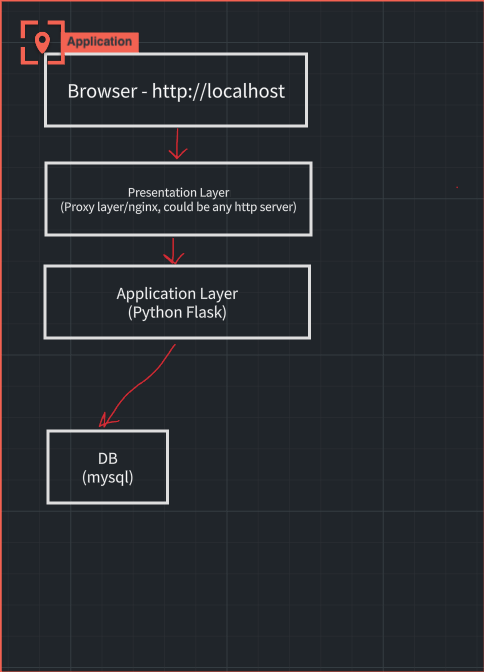
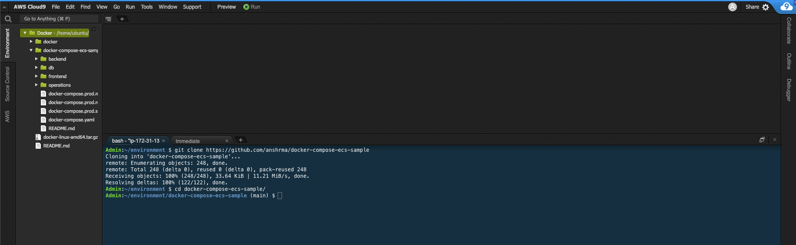
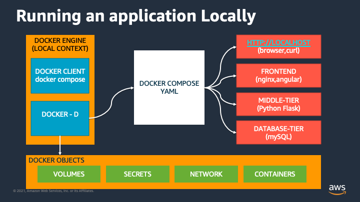

# DOCKER BUILDKIT 및 COMPOSE를 사용하여 컨테이너 이미지 빌드

## DOCKER BUILDKIT 및 COMPOSE를 사용하여 컨테이너 이미지 빌드

예상 완료 시간: 30분 - 1시간

### 소개

이 모듈에서는 Docker Compose CLI 도구, Docker Buildkit 및 Docker Hub를 사용하여 자체 컨테이너 이미지를 빌드하는 방법을 배웁니다. 또한 Docker Compose 파일을 활용하여 애플리케이션을 빌드하는 방법도 배웁니다. 그런 다음 로컬에서 애플리케이션을 테스트하여 작동하는지 확인합니다. 이 모듈의 나머지 부분을 이해하는 데 도움이 되는 Docker Compose가 무엇인지 논의해 보겠습니다.

### 도커 작성


지금까지 Dockerfile을 사용하여 단일 컨테이너 애플리케이션 용 컨테이너 이미지를 빌드할 수 있다는 것을 배웠지 만 제대로 실행하기 위해 여러 컨테이너 이미지 가 필요한 애플리케이션이 있는 경우 어떻게 해야 합니까? 여기에서 Docker Compose가 등장합니다.

Docker Compose는 다중 컨테이너 Docker 애플리케이션을 정의하고 실행하기 위한 도구입니다. Docker Compose에서는 YAML 파일을 사용하여 애플리케이션 서비스를 구성합니다. 그런 다음 단일 명령으로 구성 파일에서 모든 서비스를 만들고 시작합니다. 예를 들면 애플리케이션에 데이터베이스 또는 캐싱 메커니즘을 추가하는 것입니다. 모듈 2에서 이러한 특정 메커니즘을 활용하는 방법을 배웁니다.

### Docker Compose 파일은 Dockerfile과 어떻게 다릅니까?

컨테이너 및 Docker를 처음 사용하는 사용자는 Dockerfile 및 Docker Compose 파일을 언제 어디서 사용해야 하는지 혼란스러울 수 있습니다. 둘 중 하나를 사용할 수 있는 상황이 있지만 실제로 배포하려는 응용 프로그램의 복잡성에 달려 있습니다. 최신 응용 프로그램에서는 응용 프로그램이 둘 다 사용 하는 것을 보는 것이 매우 일반적 입니다. 이것이 의미하는 바는 애플리케이션을 빌드하기 위해 Dockerfile에 의존하는 Docker Compose 파일을 가질 수 있다는 것입니다. 이 섹션에서 우리는 애플리케이션을 구축할 때 두 가지를 모두 활용하는 방법을 배울 것이므로 이것이 지금 당장 이해가 되지 않는다면 이 모듈이 끝날 무렵에는 확실히 이해될 것입니다.

### Amazon ECS와 Docker Compose 통합

Docker Compose CLI를 통해 개발자는 클라우드 네이티브 애플리케이션을 구축할 때 네이티브 Docker 명령을 사용하여 Amazon Elastic Container Service(Amazon ECS)에서 애플리케이션을 실행할 수 있습니다.

Docker와 Amazon ECS 간의 통합을 통해 개발자는 Docker Compose CLI를 사용하여 다음을 수행할 수 있습니다.

* 하나의 Docker 명령으로 AWS 컨텍스트를 설정하여 로컬 컨텍스트에서 클라우드 컨텍스트로 전환하고 애플리케이션을 빠르고 쉽게 실행할 수 있습니다.
* Compose 파일을 사용하여 Amazon ECS에서 다중 컨테이너 애플리케이션 개발 간소화

또한 참조 [ECS 통합 아키텍처](https://docs.docker.com/cloud/ecs-architecture/), [작성 기능의 전체 목록](https://docs.docker.com/cloud/ecs-compose-features/).

## 1단계: 샘플 애플리케이션 개요

### 샘플 애플리케이션 개요

이 모듈에 사용할 응용 프로그램은 모두 NGINX에서 만든 웹 서버에서 실행되는 MYSQL 데이터베이스를 실행하는 백엔드가 있는 Flask 응용 프로그램으로 구성됩니다.



샘플 애플리케이션의 소스 코드는 GitHub에 있습니다. GitHub 계정에 로그인하고 리포지토리를 분기합니다.https://github.com/anshma/docker-compose-ecs-sample. 이 모듈에서 사용할 모든 코드가 있는 디렉토리로 변경합니다.

```
$ git clone https://github.com/"your github username"/docker-compose-ecs-sample
```

```
cd ~/environment/docker-compose-ecs-sample
```

위의 지시를 따를 수 있었다면 Cloud9 파일 디렉토리는 다음과 같아야 합니다.



## 2단계: 로컬에서 이미지 빌드

### 파일 개요 작성

이제 애플리케이션에 필요한 모든 코드와 파일로 리포지토리를 성공적으로 복제했으므로 도커 작성 파일을 사용하여 로컬에서 이미지를 빌드하는 방법을 살펴보겠습니다.

Cloud9에서 볼 수 있습니다 docker-compose.yml 파일을 열고 docker-compose.yml 파일을 보고 이 파일이 무엇을 하는지 알아봅시다.

```
services:
  db:
    image: mysql:8.0.19
    command: '--default-authentication-plugin=mysql_native_password'
    restart: always
    secrets:
      - db-password
    volumes:
      - db-data:/var/lib/mysql
    networks:
      - backnet
    environment:
      - MYSQL_DATABASE=example
      - MYSQL_ROOT_PASSWORD_FILE=/run/secrets/db-password
  backend:
    build: 
      context: ./backend
    restart: always
    secrets:
      - db-password
    # ports:
    #   - 5000:5000
    networks:
      - backnet
      - frontnet
    depends_on:
      - db
  proxy:
    build: 
      context: ./proxy
    restart: always
    ports:
      - 3000:80
    networks:
      - frontnet
    depends_on:
      - backend
volumes:
  db-data:
secrets:
  db-password:
    # This is mounted to /run/secrets/ onto the container using it
    file: db/password.txt
networks:
  backnet:
  frontnet:
```

세 가지 서비스가 있습니다. db,backend그리고 proxy. 각각을 살펴보고 각각의 작성 사양을 이해하겠습니다.

### DB

이것이 mysql 8.0.19Docker Hub에서 직접 사용하려는 이미지의 버전입니다. 그것은 마운트지속 볼륨 로 명명 db-data 그리고 그것을 묶는다. /var/lib/mysql 길.

우리는 사용 비밀 에 위치한 파일 db/password.txt당신의 파일 시스템에. 비밀 이름은db-password. 이 비밀은 애플리케이션에서 사용됩니다.backend컨테이너 이미지를 실행할 때 mysql 데이터베이스에 연결합니다. 비밀이 마운트됩니다/run/secrets 그것을 사용하여 용기에.

우리도 2개 장착 환경 변수 NS MYSQL\_DATABASE 이것은 데이터베이스 이름이고 MYSQL\_ROOT\_PASSWORD\_FILE 암호 파일의 위치입니다.

### 백엔드

이 서비스는 Python 애플리케이션이며 Dockerfile은 다음 위치에 있습니다. ./backend 다음과 같은 비밀을 사용합니다. db-password위에서 정의한 것입니다. 우리는 서비스 시작 및 종료 순서를 다음을 사용하여 제어합니다.depends\_on 보장하는 속성 backend서비스 컨테이너는 db실행 중일 때만 초기화를 시작합니다 .

에 있는 Dockerfile을 살펴보십시오. ./backend 자세한 내용은 디렉토리를 참조하십시오.

### 프론트엔드

이 서비스는 포트 80에서 트래픽을 수신 대기하기 위해 NGINX에서 제공하는 프록시일 뿐입니다. ./frontend 폴더는 일단 초기화를 시작합니다 backend 컨테이너가 실행 중입니다.

NS frontend services는 Flask 앱이며 다음 위치에 있습니다. ./frontend예배 규칙서. NSbackend 서비스는 Python REST API이며 다음 위치에 있습니다. ./backend예배 규칙서. image속성 을 설정하여 이미지 이름을 지정하고 속성을 사용하여 노출할 포트를 Docker에 알려줍니다 ports.

에 있는 Dockerfile을 살펴보십시오. ./frontend 자세한 내용은 디렉토리를 참조하십시오.

### docker compose를 사용하여 로컬에서 이미지 빌드

우리는 사용할 것입니다 docker compose build 로컬에서 이미지를 빌드합니다. docker composeGoLang으로 작성되었습니다. 우리는 사용할 것입니다기본 컨텍스트 로컬에서 응용 프로그램을 실행합니다.

기본값을 사용하도록 컨텍스트 변경

```
$ docker compose build
To provide feedback or request new features please open issues at https://github.com/docker/compose-cli
[+] Building 17.2s (17/17) FINISHED                                                                                                                                                                                                                                             
 => [docker-compose-ecs-sample_backend internal] load build definition from Dockerfile                                                                                                                                               => [docker-compose-ecs-sample_frontend internal] load build definition from Dockerfile                                                                                                                                               
```

사용 docker images 빌드된 이미지를 보려면

```
$ docker images                                                                                                                                                                                                                  
REPOSITORY                           TAG       IMAGE ID       CREATED         SIZE                                                                                                                                                                                              
docker-compose-ecs-sample_backend    latest    23c47f773f3c   4 minutes ago   67.5MB                                                                                                                                                                                            
docker-compose-ecs-sample_frontend   latest    974b4e988825   4 weeks ago     18MB 
```

### Docker Hub에 이미지 푸시

도커 허브 ID를 환경 변수로 설정하십시오.

```
DOCKER_HUB_ID=FILL_ME_WITH_YOUR_DOCKER_HUB_ID
```

선행 조건 중에 생성한 도커 허브 ID와 비밀번호를 사용하여 도커 허브에 로그인합니다(아직 완료되지 않은 경우).

```
$ docker login -u ${DOCKER_HUB_ID}
Password: 
Login Succeeded
```

### Docker 허브에 푸시

```
docker tag docker-compose-ecs-sample_backend:latest ${DOCKER_HUB_ID}/docker-compose-ecs-sample_backend:latest
docker tag docker-compose-ecs-sample_frontend:latest ${DOCKER_HUB_ID}/docker-compose-ecs-sample_frontend:latest

docker push ${DOCKER_HUB_ID}/docker-compose-ecs-sample_backend:latest
docker push ${DOCKER_HUB_ID}/docker-compose-ecs-sample_frontend:latest
```

## 3단계: 로컬에서 애플리케이션 실행

### 로컬에서 애플리케이션 실행

이제 애플리케이션을 로컬로 빌드했으므로 Docker Compose를 사용하여 애플리케이션을 로컬에서 실행할 수 있습니다. 우리는 사용할 것입니다docker compose up 우리가 정의한 세 가지 서비스를 모두 시작하려면 docker-compose.yaml파일. 우리는 사용할 것입니다기본 컨텍스트 로컬에서 응용 프로그램을 실행합니다.

애플리케이션을 로컬에서 테스트하는 것에 대해 이야기할 때 이는 Cloud9을 통한 가상 작업 공간 환경을 참조한다는 점에 유의하십시오. 이 섹션의 뒷부분에서 다음으로 이동하여 애플리케이션을 테스트할 수 있는 대신http://localhost:3000Chrome 또는 Firefox에서는 curl대신 명령을 사용하여 애플리케이션을 테스트할 것입니다.



```
$ docker compose up -d
[+] Running 6/6
 ⠿ Network "docker-compose-ecs-sample_frontnet"    Created  0.3s
 ⠿ Network "docker-compose-ecs-sample_backnet"     Created  0.3s
 ⠿ Network "docker-compose-ecs-sample_default"     Created  0.3s
 ⠿ Container docker-compose-ecs-sample_db_1        Started  0.8s
 ⠿ Container docker-compose-ecs-sample_backend_1   Started  1.7s
 ⠿ Container docker-compose-ecs-sample_frontend_1  Started  2.5s 
```

이 단계는 몇 분 정도 걸릴 수 있습니다. 당신은 실행할 수 있습니다docker compose logs 로그를 보려면

```
Admin:~/environment/docker-compose-ecs-sample (main) $ docker compose logs
backend_1  |  * Serving Flask app "hello.py"
backend_1  |  * Environment: production
backend_1  |    WARNING: This is a development server. Do not use it in a production deployment.
backend_1  |    Use a production WSGI server instead.
backend_1  |  * Debug mode: off
backend_1  |  * Running on http://0.0.0.0:5000/ (Press CTRL+C to quit)
db_1       | 2021-03-26 17:38:51+00:00 [Note] [Entrypoint]: Entrypoint script for MySQL Server 8.0.19-1debian10 started.
db_1       | 2021-03-26 17:38:51+00:00 [Note] [Entrypoint]: Switching to dedicated user 'mysql'
db_1       | 2021-03-26 17:38:51+00:00 [Note] [Entrypoint]: Entrypoint script for MySQL Server 8.0.19-1debian10 started.
db_1       | 2021-03-26T17:38:52.231725Z 0 [Warning] [MY-011070] [Server] 'Disabling symbolic links using --skip-symbolic-links (or equivalent) is the default. Consider not using this option as it' is deprecated and will be removed in a future release.
db_1       | 2021-03-26T17:38:52.231834Z 0 [System] [MY-010116] [Server] /usr/sbin/mysqld (mysqld 8.0.19) starting as process 1
db_1       | 2021-03-26T17:38:53.016895Z 0 [Warning] [MY-010068] [Server] CA certificate ca.pem is self signed.
db_1       | 2021-03-26T17:38:53.022888Z 0 [Warning] [MY-011810] [Server] Insecure configuration for --pid-file: Location '/var/run/mysqld' in the path is accessible to all OS users. Consider choosing a different directory.
db_1       | 2021-03-26T17:38:53.075577Z 0 [System] [MY-010931] [Server] /usr/sbin/mysqld: ready for connections. Version: '8.0.19'  socket: '/var/run/mysqld/mysqld.sock'  port: 3306  MySQL Community Server - GPL.
db_1       | 2021-03-26T17:38:53.091186Z 0 [System] [MY-011323] [Server] X Plugin ready for connections. Socket: '/var/run/mysqld/mysqlx.sock' bind-address: '::' port: 33060
```

명령줄에서 다음을 실행합니다.

애플리케이션 로드

```
curl http://localhost:3000
```

데이터베이스에 레코드 삽입

```
curl http://localhost:3000/add/2/name2
curl http://localhost:3000/add/3/name3
curl http://localhost:3000/add/4/name4
```

좋습니다. 이제 애플리케이션이 로컬에서 실행되고 있으므로 동일한 애플리케이션을 AWS로 원활하고 많은 변경 없이 마이그레이션하는 방법을 살펴보겠습니다.

리소스 검사 다음을 사용하여 생성된 볼륨 나열 docker volume ls 사용하여 검사 docker volume inspect docker-compose-ecs-sample\_db-data 다음을 사용하여 생성된 네트워크 나열 docker network ls

애플리케이션 중지 운영 docker compose down 응용 프로그램을 중지합니다.

```
$ docker compose down
[+] Running 6/6
 ⠿ Container docker-compose-ecs-sample_frontend_1  Removed  0.4s
 ⠿ Container docker-compose-ecs-sample_backend_1   Removed 10.4s
 ⠿ Container docker-compose-ecs-sample_db_1        Removed  2.2s
 ⠿ Network "docker-compose-ecs-sample_default"     Removed  0.2s
 ⠿ Network "docker-compose-ecs-sample_frontnet"    Removed  0.7s
 ⠿ Network "docker-compose-ecs-sample_backnet"     Removed  0.5s
```

### 요약

이 모듈에서는 Docker Compose를 사용하여 애플리케이션을 로컬로 빌드하는 방법과 docker-compose 파일에서 해당 리소스를 정의하여 애플리케이션에 네트워킹 및 스토리지 구성 요소를 추가하는 방법을 배웠습니다. 다음 모듈에서는 우리가 구축한 애플리케이션을 Amazon ECS에 배포하고 이 모듈에서 사용된 것과 동일한 방법론을 통해 AWS 특정 리소스를 추가하여 현대화할 것입니다.
