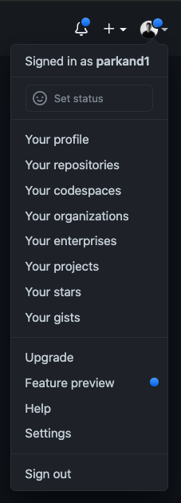
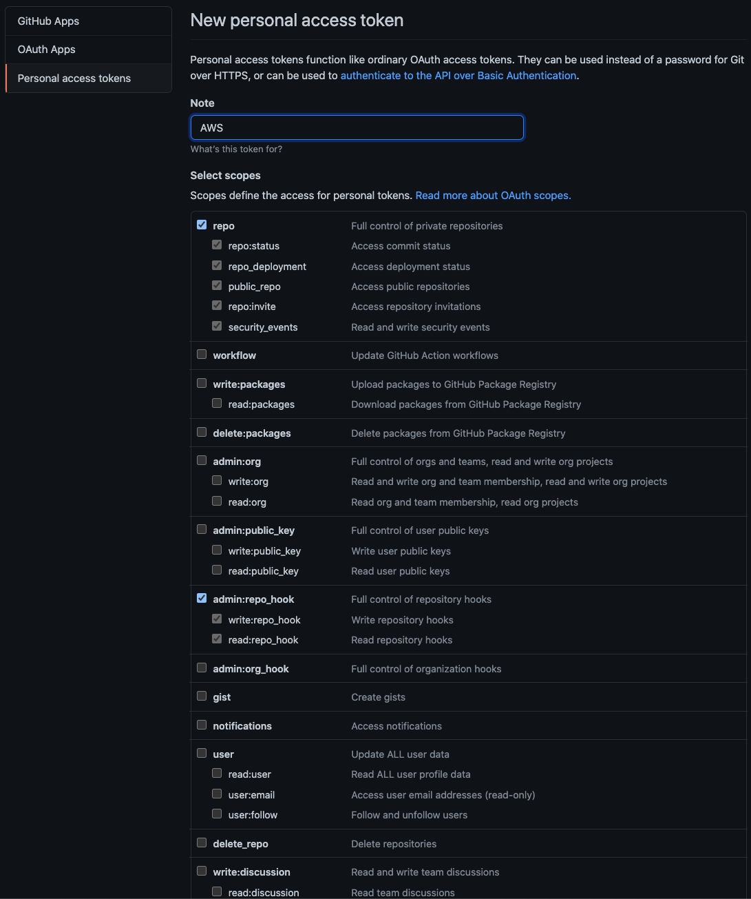
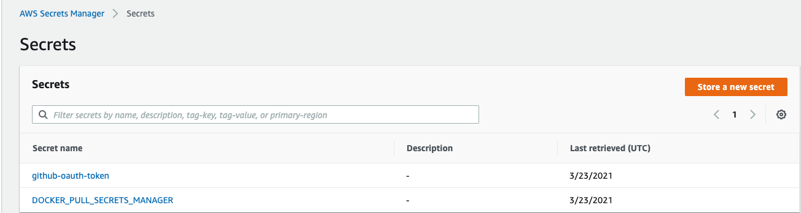
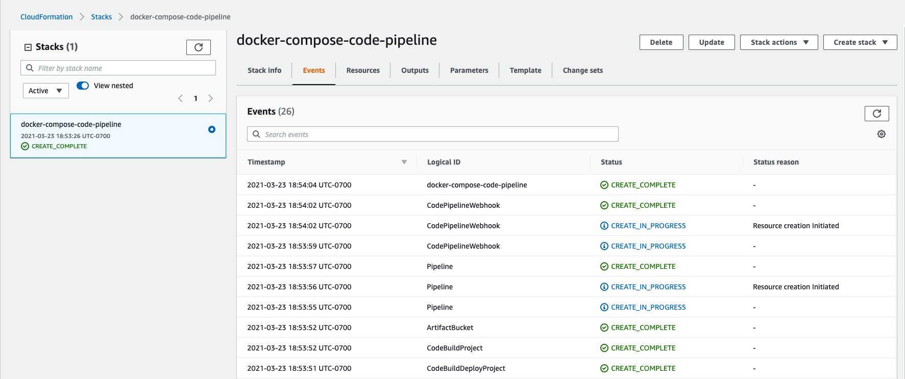
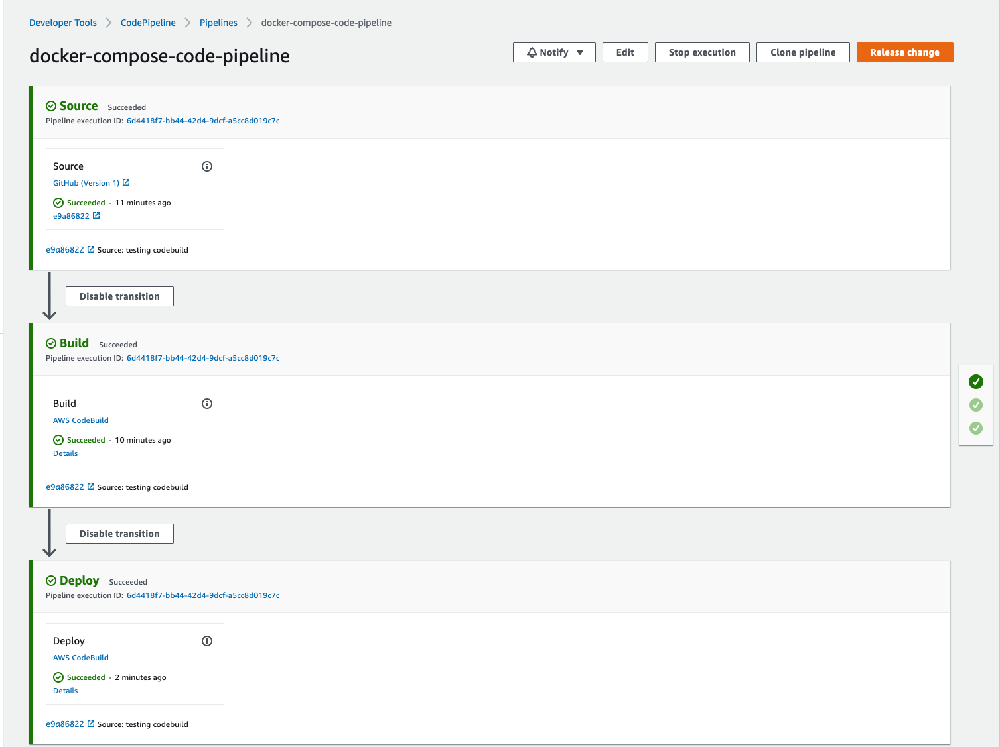
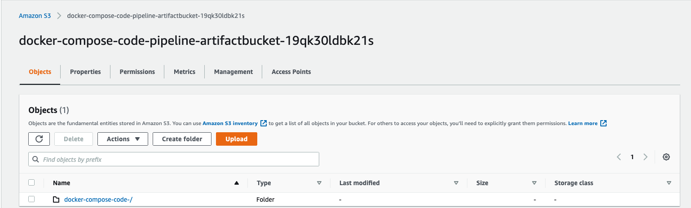

# CODEBUILD, CODEPIPELINE 및 DOCKER COMPOSE가 포함된 CI/CD

## CODEBUILD, CODEPIPELINE 및 DOCKER COMPOSE가 포함된 CI/CD

예상 완료 시간: 1시간

이전 섹션에서는 Docker Compose, BuildKit 및 Docker Hub를 활용하여 애플리케이션을 컨테이너 이미지로 빌드하고 해당 이미지를 컨테이너 이미지 리포지토리에 푸시하는 방법을 배웠습니다. 그런 다음 ECS와 Docker Compose 통합을 사용하여 해당 이미지를 가져와 Amazon ECS에 배포하는 방법을 배웠습니다. 이 섹션에서는 AWS CodeBuild 및 AWS CodePipeline으로 CI/CD 파이프라인을 구축하여 이러한 각 단계를 수동으로 수행할 필요가 없도록 배포 프로세스를 자동화하는 방법을 배웁니다.

### CI/CD 개요

배포 워크플로를 자동화하기 전에 이해해야 할 가장 중요한 사항 중 하나는 CI(지속적 통합)와 CD(지속적 배포)의 차이점을 이해하는 것입니다. 이 개념은 CI/CD 개념에 익숙하지 않은 사용자에게 혼동을 줄 수 있기 때문입니다. 파이프라인 구축을 시작하기 전에 차이점을 분석해 보겠습니다.

### 지속적 통합(CI)

CI(지속적 통합)는 변경 사항이 릴리스 분기에 병합되기 직전에 발생할 수 있는 통합 문제가 없도록 하기 위해 자동화된 빌드 및 테스트가 실행되는 중앙 리포지토리에 코드 변경 사항을 지속적으로 통합하는 개념입니다. 기능/제품 릴리스의 지연을 야기하는 버그를 포함하는 코드 변경에 대한 악몽 같은 이야기를 모두 들었습니다. 따라서 효율적인 CI 시스템을 갖추기 위해 테스트 및 빌드 프로세스를 신중하게 정의하는 것이 중요합니다.

### 지속적 개발(CD) 및 지속적 배포(CD)

연속 개발(CD)은 워크플로의 빌드 단계가 완료된 후 모든 코드 변경 사항을 테스트 및/또는 프로덕션 환경에 자동으로 배포하는 프로세스입니다. 즉, 자동화된 테스트 외에도 자동화된 릴리스 프로세스가 있으며 버튼을 클릭하여 언제든지 애플리케이션을 배포할 수 있습니다. 코드를 배포할 빈도를 결정할 수 있는 옵션이 있지만 문제를 해결해야 하는 경우 가능한 한 빨리 코드를 소규모 배치로 프로덕션에 배포하는 것이 좋습니다.

CD는 위에서 정의한 지속적인 개발과 다른 지속적인 배포로도 알려져 있습니다. 지속적인 배포는 프로덕션 파이프라인의 모든 단계를 통과하는 모든 변경 사항이 최종 사용자 또는 고객에게 릴리스된다는 점에서 실제로 지속적인 개발보다 한 단계 더 나아갑니다. 사람이 개입할 필요가 없으며 테스트에 실패할 경우에만 프로덕션에 배포할 새로운 변경 사항이 방지됩니다. 여기서의 이점은 배포 시간을 단축하고 개발자 팀이 작업이 즉시 실행되는 것을 볼 수 있으므로 소프트웨어 구축에 집중할 수 있다는 것입니다.

다음 섹션에서는 파이프라인을 사용하는 데 사용할 다양한 AWS 리소스 설정과 함께 AWS CodeBuild 및 AWS CodePipeline을 소개합니다.

## 1단계: AWS SECRETS MANAGER에 GITHUB 자격 증명 추가

GitHub를 사용하여 모든 코드 자산을 저장하고 CI/CD 파이프라인과 함께 GitHub를 사용하려면 CodePipeline 및 CodeBuild가 GitHub를 소스로 사용하여 빌드를 시작하도록 승인해야 합니다. 이 섹션에서는 이 모듈의 뒷부분에서 사용할 수 있도록 Secret Manager에 GitHub OAuth 토큰을 저장하는 방법을 설명합니다.

GitHub에서 사용할 토큰을 생성하여 시작하겠습니다. GitHub 페이지의 오른쪽 모서리에서 디스플레이 사진을 클릭하고 설정을 클릭합니다.



거기에서 개발자 설정 이라는 섹션을 찾아 개인 액세스 토큰을 클릭합니다 . 새 토큰을 생성해야 하므로 새 토큰 생성을 클릭 하고 다음 확인란을 선택합니다. 리포지토리에 대한 액세스 권한을 부여하고 리포지토리를 사용하는 웹훅에 대한 권한만 부여하면 화면이 다음과 같이 표시됩니다. 모두 정확하면 토큰 생성을 클릭합니다.



이제 새 토큰이 표시되므로 해당 토큰을 복사하여 메모장이나 다음 단계에서 참조할 수 있는 곳에 붙여넣으십시오.

AWS Secrets Manager를 사용하여 GitHub 액세스 토큰을 저장하여 CodeBuild 프로젝트가 자격 증명을 참조하고 GitHub 리포지토리를 소스로 사용할 수 있도록 합니다.

```
aws secretsmanager create-secret --name github-oauth-token
          --description "Secret for GitHub" --secret-string "insert your GitHub OAuth token"
```

명령을 성공적으로 실행할 수 있는 경우 유사한 출력이 표시되어야 합니다.

```
{
    "ARN": "arn:aws:secretsmanager:us-west-2:123456789012㊙️tutorials/MyFirstSecret-rzM8Ja",
    "Name": "github-oauth-token",
    "VersionId": "35e07aa2-684d-42fd-b076-3b3f6a19c6dc"
}
```

AWS Secrets Manager 콘솔로 이동하면 이제 두 개의 보안 비밀이 표시됩니다.

1. Docker Hub에 대한 자격 증명을 보유하는 비밀
2. Github에 대한 자격 증명을 보유하는 비밀



다음 단계에서는 AWS 팀에서 생성한 CloudFormation 템플릿을 사용하여 파이프라인 배포와 함께 AWS CodeBuild 및 AWS CodePipeline에 대한 개요를 제공합니다.

## 2단계: AWS CODEBUILD 및 AWS CODEPIPELINE 소개

이 섹션에서는 AWS CodeBuild 및 AWS CodePipeline을 선택한 도구로 사용하여 CI/CD 파이프라인을 설정합니다. 또한 CloudFormation을 사용하여 파이프라인을 배포합니다. 계속해서 AWS CodePipeline과 AWS CodeBuild에 대한 간략한 개요를 제공하여 파이프라인을 구축할 때 두 서비스가 어떻게 역할을 하는지 더 잘 이해하도록 하겠습니다.

### CloudFormation으로 CI/CD 파이프라인 배포

CI/CD 파이프라인을 설정하기 위해 CloudFormation을 사용할 것이므로 터미널에 다음 명령을 복사하여 붙여넣습니다. 참조할 CloudFormation API용 구성 파일을 포함했습니다. 배포하는 데 1-2분이 소요됩니다.

```
aws cloudformation create-stack --stack-name docker-compose-code-pipeline --template-body file://operations/code-pipeline-cloudformation.yaml --capabilities CAPABILITY_NAMED_IAM --enable-termination-protection --region us-east-1 --parameters DockerPullSecretsManagerArn=${DOCKER_PULL_SECRETS_MANAGER} GitHubOwner='your GitHub username'
```

CloudFormation 배포가 완료되면 AWS 콘솔에 다음이 표시되어야 합니다.



### AWS 코드빌드

이 섹션의 시작 부분에서 CI와 CD의 차이점과 함께 사용하여 개발 수명 주기에 자동화를 가져오는 방법을 정의했습니다. AWS CodeBuild는 파이프라인의 CI 구성 요소로 간주됩니다. AWS CodeBuild는 소스 코드를 컴파일하고 테스트를 실행하며 배포할 준비가 된 소프트웨어 패키지를 생성하는 완전 관리형 지속적 통합 서비스입니다. CodeBuild를 사용하면 자체 빌드 서버를 프로비저닝, 관리 및 확장할 필요가 없습니다. CodeBuild는 지속적으로 확장되고 여러 빌드를 동시에 처리하므로 빌드가 대기열에서 기다리지 않습니다. 사전 패키지된 빌드 환경을 사용하여 빠르게 시작하거나 고유한 빌드 도구를 사용하는 사용자 지정 빌드 환경을 만들 수 있습니다. CodeBuild를 사용하면 사용한 컴퓨팅 리소스에 대해 분 단위로 요금이 부과됩니다.

### AWS 코드 파이프라인

AWS CodePipeline은 빠르고 안정적인 애플리케이션 및 인프라 업데이트를 위해 릴리스 파이프라인을 자동화하는 데 도움 이 되는 완전관리형 지속적 전달 서비스입니다. CodePipeline은 정의한 릴리스 모델을 기반으로 코드 변경이 있을 때마다 릴리스 프로세스의 빌드, 테스트 및 배포 단계를 자동화합니다. 이를 통해 기능과 업데이트를 빠르고 안정적으로 제공할 수 있습니다. AWS CodePipeline을 GitHub와 같은 타사 서비스 또는 자체 사용자 지정 플러그인과 쉽게 통합할 수 있습니다. AWS CodePipeline을 사용하면 사용한 만큼만 비용을 지불하면 됩니다. 선결제 수수료나 장기 약정은 없습니다.

이제 CI/CD 파이프라인이 설정되었으므로 파이프라인이 수행하는 작업과 파이프라인이 제대로 실행되기 위해 의존하는 리소스를 분석해 보겠습니다.

CloudFormation 템플릿의 다음 부분을 살펴보겠습니다.

```
  CodeBuildProject:
    Type: 'AWS::CodeBuild::Project'
    Properties:
      Name: !Ref 'AWS::StackName'
      ServiceRole: !GetAtt 
        - CodeBuildServiceRole
        - Arn
      Source:
        Type: GITHUB
        Location: !Sub 'https://github.com/${GitHubOwner}/${GitHubRepository}.git'
        BuildSpec: buildspec.yaml
        Auth:
          Type: OAUTH
          Resource: !Ref CodeBuildSourceCredential
      Artifacts:
        Type: NO_ARTIFACTS
      Triggers:
        Webhook: true
        FilterGroups:
          - - Type: EVENT
              Pattern: >-
                PULL_REQUEST_CREATED, PULL_REQUEST_UPDATED,
                PULL_REQUEST_REOPENED, PULL_REQUEST_MERGED,
            - Type: BASE_REF
              Pattern: !Sub '^refs/heads/${GitHubBranch}$'
          - - Type: EVENT
              Pattern: >-
                PUSH
            - Type: HEAD_REF
              Pattern: '^refs/tags/.*'
      Environment:
        Type: LINUX_CONTAINER
        ComputeType: BUILD_GENERAL1_SMALL
        Image: !Ref CodeBuildEnvironmentImage
        EnvironmentVariables:
          - Name: DOCKERHUB_USERNAME
            Type: SECRETS_MANAGER 
            Value: $DOCKER_PULL_SECRETS_MANAGER
          - Name: DOCKERHUB_PASSWORD
            Type: SECRETS_MANAGER
            Value: $DOCKER_PULL_SECRETS_MANAGER
```

### 코드빌드

소스 아래에 GitHub를 소스 코드와 buildspec 파일이 있는 곳으로 지정합니다. 이론적으로 S3 또는 다른 소스 리포지토리를 사용하여 소스 코드와 buildspec 파일을 저장할 수도 있지만 이 작업에서는 이 워크샵의 범위를 벗어나는 추가 구성이 필요합니다. 또한 이전 단계에서 생성한 AWS Secrets Manager에서 생성된 암호를 통해 GitHub 리포지토리에 대한 인증이 포함되어 있음을 알 수 있습니다.

Triggers 섹션이 있다는 것을 알 수 있습니다. 이것이 의미하는 바는 우리가 애플리케이션의 업데이트된 버전을 빌드하도록 CodeBuild를 트리거할 CloudFormation 템플릿별 GitHub 이벤트를 정의했다는 것입니다. 현재 GitHub의 푸시 및 풀 요청 이벤트를 통해 CodeBuild를 트리거하도록 설정되어 있습니다. 이것의 좋은 점은 이벤트를 특정 요구 사항에 맞게 사용자 지정할 수 있다는 것입니다. 그러나 이 워크샵에서는 이벤트를 푸시 및 풀 요청으로 유지했습니다.

마지막으로 언급할 부분은 CodeBuild가 Docker Hub 리포지토리에 어떻게 액세스하는지 궁금할 수 있지만 모듈 1에서 기억한다면 GitHub 자격 증명을 사용하여 Secrets Manager에서도 비밀을 생성했습니다. CodeBuild가 GitHub 이벤트에 의해 트리거될 때마다 Secrets Manager에 API를 호출하는 환경 변수를 통해 이를 전달합니다.

CodeBuild가 애플리케이션 빌드를 마치면 zip 파일로 묶인 소스 코드가 포함된 폴더가 S3 버킷에 생성되는 것을 볼 수 있습니다. 다음 섹션에서는 CodeBuild가 소스 코드에서 빌드를 마치면 S3 버킷이 어떻게 생겼는지 보여드리겠습니다.

### Buildspec 빌드 및 배포

또한 /operation 폴더 아래에 두 개의 buildspec.yaml 파일이 있음을 알 수 있습니다. buildspec.yaml은 Docker 이미지를 빌드하고 해당 이미지를 Docker Hub에 푸시하기 위해 있습니다. deploysepc.yaml은 Docker 이미지를 가져오고 애플리케이션에 대한 변경 사항을 ECS에 배포하기 위해 있습니다. GitHub에서 소스 코드에 대한 변경 사항을 푸시할 때마다 백그라운드에서 무슨 일이 일어나는지 이해할 수 있도록 각 파일을 분석해 보겠습니다.

```
version: 0.2
phases:
  install:
    runtime-versions:
      python: 3.8
    commands:
      - echo "Performing manual install of compose cli"
      - curl -L -o docker-linux-amd64.tar.gz https://github.com/docker/compose-cli/releases/download/v1.0.10/docker-linux-amd64.tar.gz
      - tar xzf docker-linux-amd64.tar.gz
      - chmod +x docker/docker
      - ls -ltr
      - docker/docker compose --help
      - which docker
      - ln -s $(which docker) /usr/local/bin/com.docker.cli
  pre_build:
    commands:
      - echo Logging in to Docker Hub...
      - docker login --username $DOCKERHUB_USERNAME --password $DOCKERHUB_PASSWORD

  build:
    commands:
      - echo Build started on `date`
      - docker/docker compose build
      - echo "Tagging Docker image for Docker Hub"
      - docker images
      - docker tag src_backend:latest ${DOCKERHUB_USERNAME}/docker-compose-ecs-sample_backend:${CODEBUILD_RESOLVED_SOURCE_VERSION}
      - docker tag src_frontend:latest ${DOCKERHUB_USERNAME}/docker-compose-ecs-sample_frontend:${CODEBUILD_RESOLVED_SOURCE_VERSION}
      - docker push ${DOCKERHUB_USERNAME}/docker-compose-ecs-sample_backend:${CODEBUILD_RESOLVED_SOURCE_VERSION}
      - docker push ${DOCKERHUB_USERNAME}/docker-compose-ecs-sample_frontend:${CODEBUILD_RESOLVED_SOURCE_VERSION}
  
  post_build:
    commands:
      - echo "build successful"
```

buildspec.yaml 파일은 여러 단계로 나뉘며 코드가 빌드되기 전에 애플리케이션에 필요한 ECS 통합이 포함된 최신 버전의 Docker를 설치하는 단계를 포함합니다. 다음 단계에는 Docker Hub에 로그인하고, Docker 컨텍스트 명령을 사용하여 ECS 컨텍스트를 생성하고, Docker Compose 이미지를 빌드하는 단계가 포함됩니다. 이미지가 빌드되면 파일이 해당 이미지를 Docker Hub로 푸시합니다.

```
version: 0.2
phases:
  install:
    runtime-versions:
      python: 3.8
    commands:
      - echo "Performing manual install of compose cli"
      - curl -L -o docker-linux-amd64.tar.gz https://github.com/docker/compose-cli/releases/download/v1.0.10/docker-linux-amd64.tar.gz
      - tar xzf docker-linux-amd64.tar.gz
      - chmod +x docker/docker
      - ls -ltr
      - docker/docker compose --help
      - which docker
      - ln -s $(which docker) /usr/local/bin/com.docker.cli
  pre_build:
    commands:
      - echo Logging in to Docker Hub...
      - docker login --username $DOCKERHUB_USERNAME --password $DOCKERHUB_PASSWORD
      - STS_RESPONSE=$(curl 169.254.170.2$AWS_CONTAINER_CREDENTIALS_RELATIVE_URI)
      - export AWS_ACCESS_KEY_ID=$(echo $STS_RESPONSE | jq .AccessKeyId | tr -d \")
      - export AWS_SECRET_ACCESS_KEY=$(echo $STS_RESPONSE | jq .SecretAccessKey | tr -d \")
      - export AWS_SESSION_TOKEN=$(echo $STS_RESPONSE | jq .Token | tr -d \")
      - echo "Create Docker ECS context"
      - docker/docker context create ecs ecs-workshop --from-env
      - aws sts get-caller-identity
      - echo "Change context to use ECS context"
      - docker/docker context use ecs-workshop

  build:
    commands:
      - DOCKER_HUB_ID=${DOCKERHUB_USERNAME} DOCKER_PULL_SECRETS_MANAGER=${DOCKER_PULL_SECRETS_MANAGER} docker/docker compose -f docker-compose.yaml -f  docker-compose.prod.migrate.yaml -p ${PROJECT_NAME} up
  
  post_build:
    commands:
      - echo "deploy successful"
```

deployspec.yaml 파일은 buildspec.yaml 파일과 유사하지만 여기서 가장 큰 차이점은 Docker Hub에 푸시된 이미지를 가져온 다음 파일의 빌드 단계에서 볼 수 있는 것처럼 ECS에 배포한다는 것입니다. 모듈 2에서도 기억한다면 Docker 컨텍스트를 ECS로 설정하면 docker compose up 명령을 실행하기만 하면 docker-compose 파일에 정의된 모든 리소스를 사용하고 다른 AWS 생성과 함께 ECS에 애플리케이션을 배포합니다. 우리가 정의한 리소스도 마찬가지입니다.

다음 섹션에서는 CodePipeline이 배포 파이프라인을 조정하는 방법과 함께 이 섹션에서 다루는 개념을 보여주기 위해 소스 코드에 대한 변경 사항을 푸시할 것입니다.

## 3단계: 파이프라인 테스트

이 섹션에서는 코드 변경 사항을 GitHub에 푸시하여 CodePipeline이 배포 파이프라인을 조정하는 방법을 보여줍니다. 파이프라인이 실행되도록 다음과 같이 변경합니다. "Hello World!"를 반환하는 Flask 애플리케이션에 경로를 추가해 보겠습니다. 파이프라인이 작동함을 보여줍니다.

"Hello World!"를 반환하는 Flask 애플리케이션에 /test라는 경로를 추가합니다. backend/hello.py에 다음 코드를 변경해야 합니다.

```
import os
from flask import Flask
import mysql.connector
import uuid
import os


class DBManager:
    def __init__(self):
        password_file = os.environ.get('MY_SQL_PASSWORD_FILE','/run/secrets/db-password')
        pf = open(password_file, 'r')
        database = os.environ.get('MY_SQL_DATABASE','example')
        host = os.environ.get('MY_SQL_HOST',"db")
        user = os.environ.get('MY_SQL_USER',"root")
        self.connection = mysql.connector.connect(
            user=user, 
            password=pf.read(),
            host=host, # name of the mysql service as set in the docker-compose file
            database=database,
            auth_plugin='mysql_native_password'
        )
        pf.close()
        self.cursor = self.connection.cursor()
    
    def populate_db(self):

        self.cursor.execute('DROP TABLE IF EXISTS blog')
        self.cursor.execute('CREATE TABLE blog (id INT NOT NULL AUTO_INCREMENT PRIMARY KEY, title VARCHAR(256))')
        self.cursor.execute("insert into blog values(NULL,'initial load')")
        
        self.connection.commit()

    def insert_records(self,id,name):
        data = (id,str(name))
        query = (
                "INSERT INTO blog(id,title)"
                "VALUES (%s, %s)"
                )
        self.cursor.execute(query,data)
        self.connection.commit()
    
    def query_titles(self):
        self.cursor.execute('SELECT title FROM blog')
        rec = []
        for c in self.cursor:
            rec.append(c[0])
        return rec


server = Flask(__name__)
conn = None

@server.route('/')
def listName():
    global conn
    if not conn:
        conn = DBManager()
        conn.populate_db()
        #conn.insert_records()
    rec = conn.query_titles()

    response = ''
    for c in rec:
        response = response  + '<div>   ' + c + '</div>'
    return response

@server.route('/add/<id>/<name>')
def addName(id,name):
    global conn
    if not conn:
        conn = DBManager(password_file='/run/secrets/db-password')
    conn.insert_records(id,name)
    rec = conn.query_titles()

    response = ''
    for c in rec:
        response = response  + '<div>   ' + c + '</div>'
    return response

@server.route('/test')
def hello():
    return "Hello World!"

if __name__ == '__main__':
    server.run()
```

다음 명령을 사용하여 파일을 저장하고 GitHub 리포지토리에 변경 사항을 커밋해야 합니다.

```
$ git add .
```

```
$ git commit -m "adding test route to Flask app"
```

```
$ git push
```

CodePipeline 콘솔로 이동하면 코드 변경 사항이 제대로 배포된 경우 다음이 표시되어야 합니다.



또한 파이프라인이 소스 코드에 대한 변경 사항을 압축하고 아래와 같이 파이프라인에 대한 아티팩트를 보유하는 책임이 있는 S3 버킷에 저장한다는 것을 알 수 있습니다.



마지막 테스트는 /test앱 에서 경로 를 탐색하여 성공적으로 변경되었는지 확인하는 것입니다. 응용 프로그램의 변경 사항을 보려면 다음을 복사하여 붙여넣습니다.

```
docker compose ps

docke-LoadB-ZUJVKEFNFM4J-ce26ed3e7fa4dce7.elb.us-east-1.amazonaws.com:3000/test
```

## 결론

축하 해요! 오늘의 워크샵이 끝났습니다. 오늘의 피드백 양식을 작성해주세요.할 것

## 축하합니다

### 잘 했어요

🎉 축하합니다! 🎉 AWS에서 마이그레이션 및 현대화에 대한 오늘의 예배를 완료했습니다!

### 배운 내용 복습

오늘 우리는 배웠습니다:

docker compose cli를 사용하여 로컬에서 애플리케이션을 빌드하고 실행하고 이미지를 도커 허브에 푸시하는 방법 docker compose 파일을 오버레이하고 docker compose ECS 통합을 사용하여 의견이 있는 방식으로 애플리케이션을 Amazon ECS에 원활하게 배포하는 방법. 노력 없이 ECS에서 생성된 다양한 리소스는 무엇이며 로컬 개발자 경험에 매핑하는 방법 기본 AWS 서비스를 사용하여 애플리케이션 현대화 AWS 코드 파이프라인을 사용하여 docker compose에 대한 지속적 통합 및 배포 활성화

### 마지막 생각들

ECS와 docker compose cli 통합을 사용하는 동안 조직에서 얻을 수 있는 몇 가지 성과를 보았기를 바랍니다. 질문이 있는 경우 다음을 통해 문의하세요.https://github.com/aws-samples/aws-modernization-with-docker/issues/new.

다음 단계 \[TODO]

### 대청소

대청소 계정에 요금이 청구되지 않도록 생성된 인프라를 정리하는 것이 좋습니다. 워크샵을 좀 더 검토할 수 있도록 작업을 계속 진행하려는 경우 작업이 완료되면 정리를 수행하는 것을 잊지 마십시오. AWS 계정에서 실행 중인 작업을 그대로 두고 잊어버리고 요금이 발생하는 것은 매우 쉽습니다.

```
# Delete CloudFormation Stacks
aws cloudformation delete-stack --stack-name mod-f679f4081e7d405c

echo 'Completed cleanup.'
```
